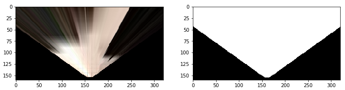
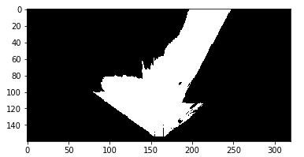
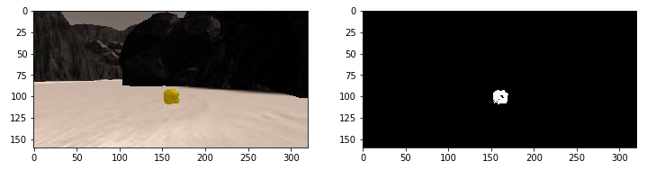

## Project 1: Search and Sample Return

**The goals / steps of this project are the following:**  

**Training / Calibration**  

* Download the simulator and take data in "Training Mode"
* Test out the functions in the Jupyter Notebook provided
* Add functions to detect obstacles and samples of interest (golden rocks)
* Fill in the `process_image()` function with the appropriate image processing steps (perspective transform, color threshold etc.) to get from raw images to a map.  The `output_image` you create in this step should demonstrate that your mapping pipeline works.
* Use `moviepy` to process the images in your saved dataset with the `process_image()` function.  Include the video you produce as part of your submission.

**Autonomous Navigation / Mapping**

* Fill in the `perception_step()` function within the `perception.py` script with the appropriate image processing functions to create a map and update `Rover()` data (similar to what you did with `process_image()` in the notebook). 
* Fill in the `decision_step()` function within the `decision.py` script with conditional statements that take into consideration the outputs of the `perception_step()` in deciding how to issue throttle, brake and steering commands. 
* Iterate on your perception and decision function until your rover does a reasonable (need to define metric) job of navigating and mapping.  

[//]: # (Image References)

[image1]: ./misc/rover_image.jpg
[image2]: ./calibration_images/example_grid1.jpg
[image3]: ./calibration_images/example_rock1.jpg 
[image4]: ./misc/screenshot1.png
[image5]: ./misc/find_rocks.png
[image6]: ./misc/field_of_view.png
[image7]: ./misc/video_output.png

## [Project Rubric](https://review.udacity.com/#!/rubrics/916/view)

### Writeup / README

#### 1. Provide a Writeup / README that includes all the rubric points and how you addressed each one.  You can submit your writeup as markdown or pdf.  

### Notebook Analysis
#### 2. Run the functions provided in the notebook on test images (first with the test data provided, next on data you have recorded). Add/modify functions to allow for color selection of obstacles and rock samples.

<div align=center>
	 <br>
	 <br>
	
</div>
</br>
Added/ modified functions to allow for color selection of obstacles and rock samples.

Identifying obstacles...

```
def perspect_transform(img, src, dst):
           
    M = cv2.getPerspectiveTransform(src, dst)
    warped = cv2.warpPerspective(img, M, (img.shape[1], img.shape[0]))# keep same size as input image
    mask = cv2.warpPerspective(np.ones_like(img[:,:,0]), M, (img.shape[1], img.shape[0])) #New
    return warped, mask #new
``` 

The following was also modified for obstacle detection...
```
# warped = perspect_transform(grid_img, source, destination)
warped, mask = perspect_transform(grid_img, source, destination)
fig = plt.figure(figsize=(12,3)) #new
plt.subplot(121) #new
plt.imshow(warped)
plt.subplot(122) #new
plt.imshow(mask, cmap='gray') #new
```

[output]

<div align=center>
	
</div>

Finding rocks...

```
def find_rocks(img, levels=(110, 110, 50)):
    rockpix = ((img[:,:,0] > levels[0]) \
              & (img[:,:,1] > levels [1]) \
              & (img[:,:,2] < levels[2]))
    
    color_select = np.zeros_like(img[:,:,0])
    color_select[rockpix] = 1
    
    return color_select

rock_map = find_rocks(rock_img)
fig = plt.figure(figsize=(12,3))
plt.subplot(121)
plt.imshow(rock_img)
plt.subplot(122)
plt.imshow(rock_map, cmap='gray')
```

[output]

<div align=center>
	
</div>

#### 3. Populate the `process_image()` function with the appropriate analysis steps to map pixels identifying navigable terrain, obstacles and rock samples into a worldmap.  Run `process_image()` on your test data using the `moviepy` functions provided to create video output of your result.

1) Define source and destination points for perspective transform
2) Apply perspective transform
```
# Perspective Transform and mask
warped, mask = perspect_transform(img, source, destination)
```

3) Apply color threshold to identify navigable terrain/obstacles/rock samples
4) Convert thresholded image pixel values to rover-centric coords
```
# Apply color threshold to identify navigable terrain/obstacles/rock samples
threshed = color_thresh(warped)
obs_map = np.absolute(np.float32(threshed) - 1) * mask
xpix, ypix = rover_coords(threshed)
```

5) Convert rover-centric pixel values to world coords
```
# Convert rover-centric pixel values to world coordinates
world_size = data.worldmap.shape[0]
scale = 2 * dst_size
xpos = data.xpos[data.count]
ypos = data.ypos[data.count]
yaw = data.yaw[data.count]
x_world, y_world = pix_to_world(xpix, ypix, xpos, ypos, yaw, world_size, scale)
obsxpix, obsypix = rover_coords(obs_map)
obs_x_world, obs_y_world = pix_to_world(obsxpix, obsypix, xpos, ypos, yaw, world_size, scale)
```

6) Update worldmap (to be displayed on right side of screen)

```
# Update worldmap (to be displayed on right side of screen)  
    data.worldmap[y_world, x_world, 2] = 255
    data.worldmap[obs_y_world, obs_x_world, 0] = 255
    nav_pix = data.worldmap[:,:,2] > 0
    
    data.worldmap[nav_pix, 0] = 0
    # see if we can find some rocks
    rock_map = find_rocks(warped, levels=(110, 110, 50))
    if rock_map.any():
        rock_x, rock_y = rover_coords(rock_map)
        rock_x_world, rock_y_world = pix_to_world(rock_x, rock_y, xpos,
                                                 ypos, yaw, world_size, scale)
        data.worldmap[rock_y_world, rock_x_world, :] = 255
```

7) Make a mosaic image

```
# Make a mosaic image, below is some example code
# First create a blank image (can be whatever shape you like)
output_image = np.zeros((img.shape[0] + data.worldmap.shape[0], img.shape[1]*2, 3))
# Next you can populate regions of the image with various output
# Here I'm putting the original image in the upper left hand corner
output_image[0:img.shape[0], 0:img.shape[1]] = img

# Let's create more images to add to the mosaic, first a warped image
# warped = perspect_transform(img, source, destination)
warped, mask = perspect_transform(img, source, destination) # function has been updated to return 2 variables
    
# Add the warped image in the upper right hand corner
output_image[0:img.shape[0], img.shape[1]:] = warped

# Overlay worldmap with ground truth map
map_add = cv2.addWeighted(data.worldmap, 1, data.ground_truth, 0.5, 0)
# Flip map overlay so y-axis points upward and add to output_image 
output_image[img.shape[0]:, 0:data.worldmap.shape[1]] = np.flipud(map_add)

# Then putting some text over the image
cv2.putText(output_image,"Populate this image with your analyses to make a video!", (20, 20), 
                cv2.FONT_HERSHEY_COMPLEX, 0.4, (255, 255, 255), 1)
if data.count < len(data.images) - 1:
    data.count += 1 # Keep track of the index in the Databucket()
    
return output_image
```
[output]

<div align=center>
	<a href="output/test_mapping.mp4">
		
	</a> <br>
	Click <a href="output/test_mapping.mp4">here</a> to view video output
</div>

### Autonomous Navigation and Mapping

#### 4. Fill in the `perception_step()` (at the bottom of the `perception.py` script) and `decision_step()` (in `decision.py`) functions in the autonomous mapping scripts and an explanation is provided in the writeup of how and why these functions were modified as they were.

For this project, I only modified the `perception_step()` at the bottom of `perceptions.py`.  (`decision.py` was left intact)

```
# Apply the above functions in succession and update the Rover state accordingly
def perception_step(Rover):
    # Perform perception steps to update Rover()
    # TODO: 
    # NOTE: camera image is coming to you in Rover.img
    # 1) Define source and destination points for perspective transform
    # 2) Apply perspective transform
    # Define calibration box in source (actual) and destination (desired) coordinates
    # These source and destination points are defined to warp the image
    # to a grid where each 10x10 pixel square represents 1 square meter
    # The destination box will be 2*dst_size on each side
    dst_size = 5 
    # Set a bottom offset to account for the fact that the bottom of the image 
    # is not the position of the rover but a bit in front of it
    # this is just a rough guess, feel free to change it!
    bottom_offset = 6
    image = Rover.img
    source = np.float32([[14, 140], [301 ,140],[200, 96], [118, 96]])
    destination = np.float32([[image.shape[1]/2 - dst_size, image.shape[0] - bottom_offset],
                  [image.shape[1]/2 + dst_size, image.shape[0] - bottom_offset],
                  [image.shape[1]/2 + dst_size, image.shape[0] - 2*dst_size - bottom_offset], 
                  [image.shape[1]/2 - dst_size, image.shape[0] - 2*dst_size - bottom_offset],
                  ])

    # warped = perspect_transform(grid_img, source, destination)
    warped, mask = perspect_transform(Rover.img, source, destination) #change from grid_img

    # 3) Apply color threshold to identify navigable terrain/obstacles/rock samples
    threshed = color_thresh(warped)
    obs_map = np.absolute(np.float32(threshed) - 1) * mask

    # 4) Update Rover.vision_image (this will be displayed on left side of screen)
        # Example: Rover.vision_image[:,:,0] = obstacle color-thresholded binary image
        #          Rover.vision_image[:,:,1] = rock_sample color-thresholded binary image
        #          Rover.vision_image[:,:,2] = navigable terrain color-thresholded binary image
    Rover.vision_image[:,:,2] = threshed * 255
    Rover.vision_image[:,:,0] = obs_map * 255

    # 5) Convert map image pixel values to rover-centric coords
    xpix, ypix = rover_coords(threshed)

    # 6) Convert rover-centric pixel values to world coordinates
    world_size = Rover.worldmap.shape[0]
    scale = 2 * dst_size
    x_world, y_world = pix_to_world(xpix, ypix, Rover.pos[0], Rover.pos[1],
                                   Rover.yaw, world_size, scale)
    obsxpix, obsypix = rover_coords(obs_map)
    obs_x_world, obs_y_world = pix_to_world(obsxpix, obsypix, Rover.pos[0], Rover.pos[1],
                                           Rover.yaw, world_size, scale)

    # 7) Update Rover worldmap (to be displayed on right side of screen)
        # Example: Rover.worldmap[obstacle_y_world, obstacle_x_world, 0] += 1
        #          Rover.worldmap[rock_y_world, rock_x_world, 1] += 1
        #          Rover.worldmap[navigable_y_world, navigable_x_world, 2] += 1
    Rover.worldmap[y_world, x_world, 2] += 10
    Rover.worldmap[obs_y_world, obs_x_world, 0] += 1

    # 8) Convert rover-centric pixel positions to polar coordinates
    dist, angles = to_polar_coords (xpix, ypix)

    # Update Rover pixel distances and angles
        # Rover.nav_dists = rover_centric_pixel_distances
        # Rover.nav_angles = rover_centric_angles
    Rover.nav_angles = angles

    # See if we can find some rocks
    rock_map = find_rocks(warped, levels=(110, 110, 50))
    if rock_map.any():
        rock_x, rock_y = rover_coords(rock_map)

        rock_x_world, rock_y_world = pix_to_world(rock_x, rock_y, Rover.pos[0], Rover.pos[1],
                                   Rover.yaw, world_size, scale)
        rock_dist, rock_ang = to_polar_coords (rock_x, rock_y)
        rock_idx = np.argmin(rock_dist)
        rock_xcen = rock_x_world[rock_idx]
        rock_ycen = rock_y_world[rock_idx]

        Rover.worldmap[rock_ycen, rock_xcen, 1] = 255
        Rover.vision_image[:,:,1] = rock_map*255
    else:
        Rover.vision_image[:,:,1] = 0
    
 
    
    
    return Rover
```

#### 5. Launching in autonomous mode your rover can navigate and map autonomously.  Explain your results and how you might improve them in your writeup.  

**Note: running the simulator with different choices of resolution and graphics quality may produce different results, particularly on different machines!  Make a note of your simulator settings (resolution and graphics quality set on launch) and frames per second (FPS output to terminal by `drive_rover.py`) in your writeup when you submit the project so your reviewer can reproduce your results.**

Here I'll talk about the approach I took, what techniques I used, what worked and why, where the pipeline might fail and how I might improve it if I were going to pursue this project further.  

With the code in my project, the rover was able to drive and map autonomously through the lanscape.  The rover was able to map more than 40% of the envionrment with more than 60% of fidelity (accuracy) against the ground truth.  See screenshot of the result:

<div align=center>
	 <br>
</div>

Approach:

Techniques used: 


What worked and what didn't:


Where the pipeline might fail:


How it might be improved: 


