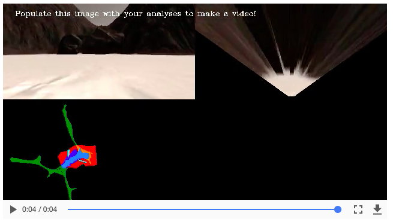

# Project 1: Search and Sample Return

## [Project Rubric](https://review.udacity.com/#!/rubrics/916/view)

### Writeup / README

#### 1. Provide a Writeup / README that includes all the rubric points and how you addressed each one.  You can submit your writeup as markdown or pdf.  

### Notebook Analysis

#### 2. Run the functions provided in the notebook on test images (first with the test data provided, next on data you have recorded).

My first modification to the code was to redirect the path variable to my own dataset of pictures that I captured with the rover <br>
`path = '../carl_dataset/IMG/*'` <br>

I kept the code in the Calibration Data section intact.  I could have created a 'grid' picture of my own via the Rover app but decided to keep what was there already.
The grid image is required for the perspective transform function.  You could say that this is the initial step for the perspective transform process. <br>
```
example_grid = '../calibration_images/example_grid1.jpg'
example_rock = '../calibration_images/example_rock1.jpg'
grid_img = mpimg.imread(example_grid)
rock_img = mpimg.imread(example_rock)

fig = plt.figure(figsize=(12,3))
plt.subplot(121)
plt.imshow(grid_img)
plt.subplot(122)
plt.imshow(rock_img)
```
<br>
<div align=center>
	 <br>
</div>
</br>

Also, the first step in color thresholding process for rock identification is getting a screenshot of the rock samples that will be searched. <br>
<br>
<div align=center>
	 <br>
</div>
</br>

**Modifications to the `perspect_transform` function** <br>
Purpose: This function transforms the picture, from the ground, to a top-down view of the world. <br>
<div align=center>
	
</div>
<br>

Lines of code were added in the **Perspective Transform** section to exclude the processing of pixels that were outside the field of view of the camera. <br>
```
def perspect_transform(img, src, dst):
	...
	mask = cv2.warpPerspective(np.ones_like(img[:,:,0]), M, (img.shape[1], img.shape[0])) #New
    return warped, mask #new
    

warped, mask = perspect_transform(grid_img, source, destination)
fig = plt.figure(figsize=(12,3)) #new
plt.subplot(121) #new
plt.imshow(warped)
plt.subplot(122) #new
plt.imshow(mask, cmap='gray') #new
```
<div align=center>
	 <br>
</div>
<br>


**Modifications to the `color_thresh` (color thresholding function)** <br>
Purpose:  The purpose of this function is to help identify navigable terrain versus obstacles (or non-navigable terrain). <br>
<div align=center>
	 <br>
	 <br>
</div>
</br>
note: a separate function will identify rocks.
<br><br>

another note:  the entire **Coordinate Transformations** section in the notebook remains the same. <br>
This is the section of the notebook where the code converts image coordinates to rover coordinates and then to world coordinates. <br>
<br>

**Added new section in notebook to find rocks** <br>
A new section was added in the notebook to identify rocks in the environment called `find_rocks`. <br>
<br>
To identify the rocks, the RGB values were set to 110, 110, 50 <br>
A rock would be identified when the red channel was greater than 110, the green channel greater than 110 and the blue channel less than 50 <br>
```
def find_rocks(img, levels=(110, 110, 50)):
    rockpix = ((img[:,:,0] > levels[0]) \
              & (img[:,:,1] > levels [1]) \
              & (img[:,:,2] < levels[2]))
    
    color_select = np.zeros_like(img[:,:,0])
    color_select[rockpix] = 1
    
    return color_select

rock_map = find_rocks(rock_img)
fig = plt.figure(figsize=(12,3))
plt.subplot(121)
plt.imshow(rock_img)
plt.subplot(122)
plt.imshow(rock_map, cmap='gray')

```
<div align=center>
	
</div>
</br>

#### 3. Populate the `process_image()` function with the appropriate analysis steps to map pixels identifying navigable terrain, obstacles and rock samples into a worldmap.  Run `process_image()` on your test data using the `moviepy` functions provided to create video output of your result.

So to start off, at this point, we have all images in a saved dataset called `data`. And now we want to process them. <br>
Once the images havs been processed, a library called `moviepy` will create a video out of the processed images.

Each image is processed by the `perspec_transform` and `color_thresh` functions <br>
```
warped, mask = perspect_transform(img, source, destination)
threshed = color_thresh(warped)
```
note:  `mask` was added to exclude pixels outside the camera view <br>

next, the threshold map is created <br>
`  obs_map = np.absolute(np.float32(threshed) - 1) * mask` <br>
the code will output '1' wherever the map shows a '0'(because of the -1 and absolute value) and then multiply by mask (which has '0' for pixels outside the view of the camera)<br>
The above gives you a map of where the obstacle pixels are, excluding the pixels that are outside the field of view. <br>

then, from the thresholded images, the navigable terrain identified from the images are converted to rover-centric coordinates <br>
`xpix, ypix = rover_coords(threshed)` <br>

afterwards, the world map is updated with obstacles, rock location, and navigable terrain. 
<br>
```
data.worldmap[y_world, x_world, 2] = 255
data.worldmap[obs_y_world, obs_x_world, 0] = 255

nav_pix = data.worldmap[:,:,2] > 0
    
data.worldmap[nav_pix, 0] = 0

rock_map = find_rocks(warped, levels=(110, 110, 50))
if rock_map.any():
    rock_x, rock_y = rover_coords(rock_map)
    rock_x_world, rock_y_world = pix_to_world(rock_x, rock_y, xpos,
                                                 ypos, yaw, world_size, scale)
    data.worldmap[rock_y_world, rock_x_world, :] = 255
``` 
<br>

In the worldmap, we want to identify 3 components with 3 different colors. <br>
We want to identify navigable terrain and add them to the blue channel <br>
`data.worldmap[y_world, x_world, 2] = 255`

We also want to identify obstacles and add them to the red channel <br>
`data.worldmap[obs_y_world, obs_x_world, 0] = 255` <br>

Next, the rock_map is updated when rocks are found. <br>

``` 
 rock_map = find_rocks(warped, levels=(110, 110, 50))
    if rock_map.any():
        rock_x, rock_y = rover_coords(rock_map)
        rock_x_world, rock_y_world = pix_to_world(rock_x, rock_y, xpos,
                                                 ypos, yaw, world_size, scale)
        data.worldmap[rock_y_world, rock_x_world, :] = 255
``` 

In the above code, `data.worldmap[rock_y_world, rock_x_world, :] = 255` adds the rock detection in green color.
<br>

The last section in `process_image` is to run `moviepy`to view the processed images in sequence for a movie-like view of the results. <br>

<div align=center>
	<a href="output/test_mapping.mp4">
		
	</a> <br>
	Click <a href="output/test_mapping.mp4">here</a> to view video output
</div>

### Autonomous Navigation and Mapping

#### 4. Fill in the `perception_step()` (at the bottom of the `perception.py` script) and `decision_step()` (in `decision.py`) functions in the autonomous mapping scripts and an explanation is provided in the writeup of how and why these functions were modified as they were.<br>

At this point of the project, I am able to take the code added into the `process_image()` function in the notebook and place it (with a few changes) to the `perception_step()` function in the `perception.py` script <br>
note:  I did not make any changes to the `decision.py` script <br>

**perception_step()**

For the most pasrt, the `perceptions_step()` function comes pre-populated with all of the functions we found in the notebook in our previous exercise <br>
Most of the changes required to the `perception_step()` can be taken from the code added to the `process_image` function in the Jupyter Notebook exercise <br>

Different as the perception step takes in the Rover object (as opposed to the Data object in the notebook) <br>
- The Rover object gives us access to all things Rover, such at the images the rover is seeing, the position, the yaw, etc... <br>
- I'm going to use the image in particular to do some analysis on things like driveable terrain versus avoiding obstacles <br>
- Then store the output of the perception into various fields inside the rover such as color-thresholded images for obstacles and color thresholded images for navigable terrain. <br>
- Then, feed the steering variables such as nav_angles to steer the rover.  If this is not updated, the rover will drive into a straight line until it bumps into an object. <br>

**Modification #1: mask pixels that are outside the field of view of the camera** <br>
Similar to the changes in the notebook, I added the `mask` variable to the `perspect_tranform` function to mask the pixels outside the field of view of the camera <br>
`mask = cv2.warpPerspective(np.ones_like(img[:,:,0]), M, (img.shape[1], img.shape[0])) #new`

**Modification #2:  added find_rocks function to find and tally rocks in the environment** <br>
Also, similar to the changes in the notebook, I added the find_rocks function to find and tally the rocks that are found on the captured images <br>

```
def find_rocks(img, levels=(110, 110, 50)):
    rockpix = ((img[:,:,0] > levels[0]) \
              & (img[:,:,1] > levels [1]) \
              & (img[:,:,2] < levels[2]))
    
    color_select = np.zeros_like(img[:,:,0])
    color_select[rockpix] = 1
    
    return color_select
```

**Modification #3: added code to define the `perspect_transform` points for source and destination images**
Within the `perspect_transform()` function, code was added to identify the points in the image to translate the image from ground view to a top-down view of the world. <br>

```
 source = np.float32([[14, 140], [301 ,140],[200, 96], [118, 96]])
    destination = np.float32([[image.shape[1]/2 - dst_size, image.shape[0] - bottom_offset],
                  [image.shape[1]/2 + dst_size, image.shape[0] - bottom_offset],
                  [image.shape[1]/2 + dst_size, image.shape[0] - 2*dst_size - bottom_offset], 
                  [image.shape[1]/2 - dst_size, image.shape[0] - 2*dst_size - bottom_offset],
                  ])
```
After this, the `perspect_transform` function did its thing and then the warped images are color-thresholded for navigable terrain vs obstacles <br>
```
warped, mask = perspect_transform(Rover.img, source, destination)

threshed = color_thresh(warped)
obs_map = np.absolute(np.float32(threshed) - 1) * mask

```

with the existing code, a world map can be created to track the movement of the rover <br>

<div align=center>
	 <br>
</div>
</br>

#### 5. Launching in autonomous mode your rover can navigate and map autonomously.  Explain your results and how you might improve them in your writeup.  

**Settings** <br>
Simulator screen resolution = 720 x 480 <br>
fps = 25 in simulator <br>
fps = 60 in moviepy <br>

With the code in my project, I was able to map more 40% of the environment with more than 60% of fidelity against the ground truth.  See screenshot below... <br>
<div align=center>
	 <br>
</div>
</br>

Here I'll talk about the approach I took, what techniques I used, what worked and why, where the pipeline might fail and how I might improve it if I were going to pursue this project further. <br> 

**Approach** <br>
In this project, I took to approach of learning and dissecting the functionality via the Jupyter Notebook.  The notebook does a nice job at breaking down pieces of functionality for targeted learning.<br>
I also watched the walkthrough video to give me an overall understanding of the final solution.  

**Techniques** <br>
The technique I used to get to the final result was to divide the task into it's smallest components.  With the help of Jupyter Notebook, I was able to work on small pieces of code and incrementally tackled each of the steps to make the rover drive autonomously. <br>

**What worked and why** <br>
Reviewed the course materials and the walkthrough video help me deepen my understanding of the functionality in this project.  Again, taking the time to review each line of code helped me understanding how smaller components contributes to the overall goal of getting a rover to navigate autonomously. <br> 

**Where can it fail?** <br>
Depending on the start location of the rover, fidelity can be below 60% at the point where the environment has been mapped at 40%. <br>


**how can it be improved?** <br>
1. Explore the `to_polar_coords` function to direct the rover to the most navigable terrain <br>
2. Improve the overlap between navigable terrain and obstacles <br>


