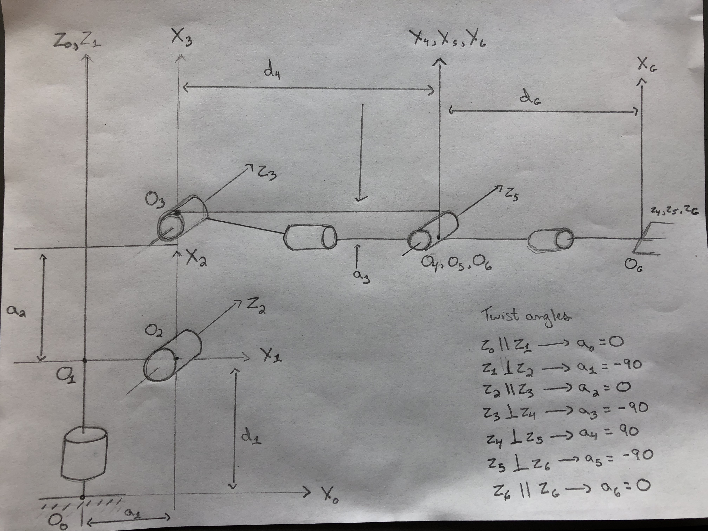
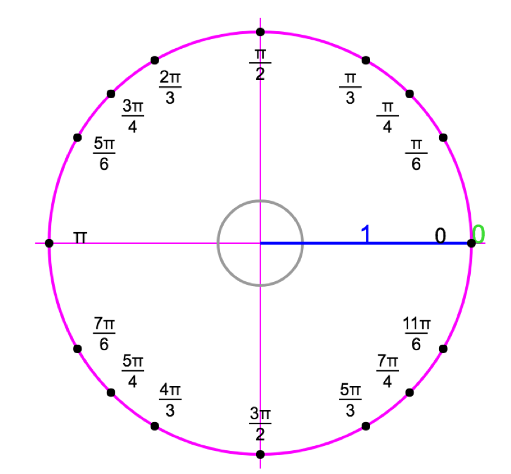
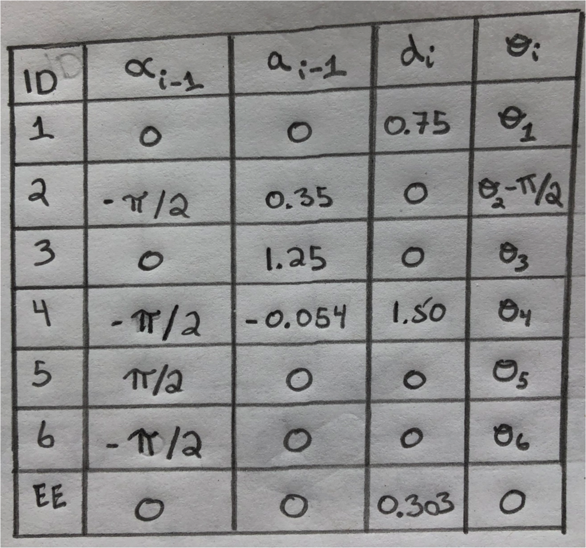

## Project: Kinematics Pick & Place
### The Writeup
In this project, a simulated Kuka KR210 arm targets, picks up, and disposes a can from a shelf to a dropbox.

	

 

[//]: # (Image References)

[image1]: ./misc_images/misc1.png
[image2]: ./misc_images/misc3.png
[image3]: ./misc_images/misc2.png

### Kinematic Analysis
#### 1. Run the forward_kinematics demo and evaluate the kr210.urdf.xacro file to perform kinematic analysis of Kuka KR210 robot and derive its DH parameters.

Below is a code snippet from the kr210.urdf.xacro file:

'''
placeholder
'''

Below is a summary of the DH parameter assignment process:
 

	

		

 
Visual for angles:

		

 

Below are the DH parameters for this project:
  

	

#### 2. Using the DH parameter table you derived earlier, create individual transformation matrices about each joint. 

Links | alpha(i-1) | a(i-1) | d(i-1) | theta(i)
--- | --- | --- | --- | ---
0->1 | 0 | 0 | L1 | qi
1->2 | - pi/2 | L2 | 0 | -pi/2 + q2
2->3 | 0 | 0 | 0 | 0
3->4 |  0 | 0 | 0 | 0
4->5 | 0 | 0 | 0 | 0
5->6 | 0 | 0 | 0 | 0
6->EE | 0 | 0 | 0 | 0

In addition, also generate a generalized homogeneous transform between base_link and gripper_link using only end-effector(gripper) pose.
 
[placeholder]
 

#### 3. Decouple Inverse Kinematics problem into Inverse Position Kinematics and inverse Orientation Kinematics; doing so derive the equations to calculate all individual joint angles.

And here's where you can draw out and show your math for the derivation of your theta angles. 

![alt text][image2]

### Project Implementation

#### 1. Fill in the `IK_server.py` file with properly commented python code for calculating Inverse Kinematics based on previously performed Kinematic Analysis. Your code must guide the robot to successfully complete 8/10 pick and place cycles. Briefly discuss the code you implemented and your results. 

Here I'll talk about the code, what techniques I used, what worked and why, where the implementation might fail and how I might improve it if I were going to pursue this project further.  

