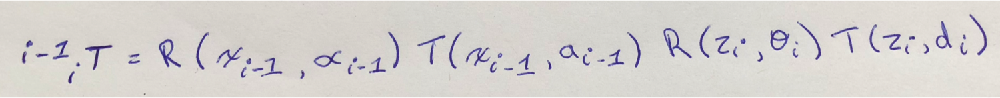
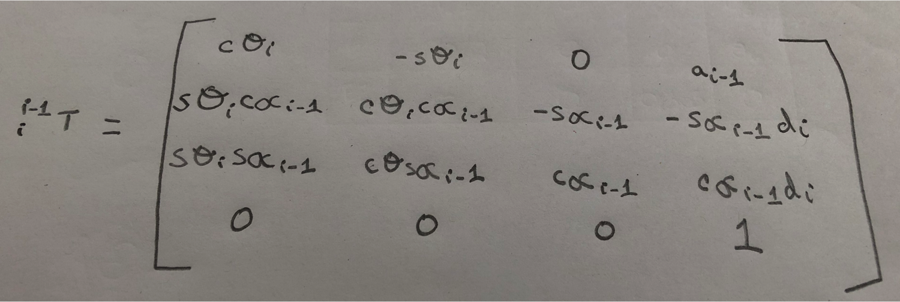
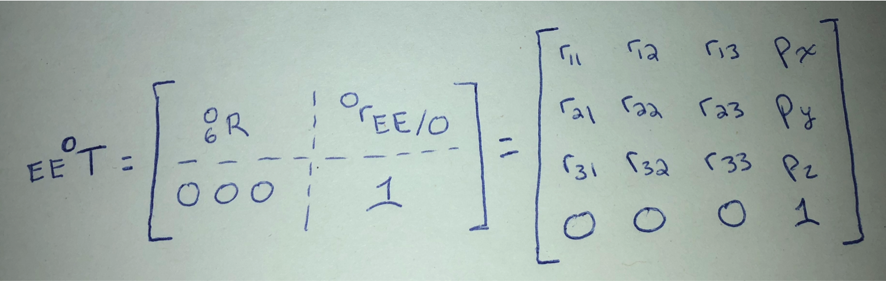
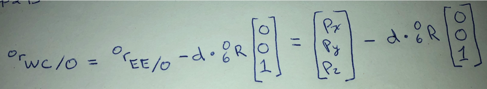
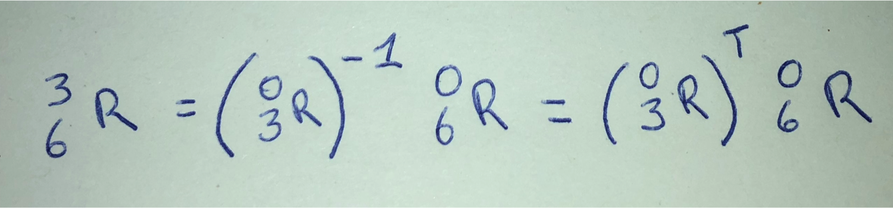
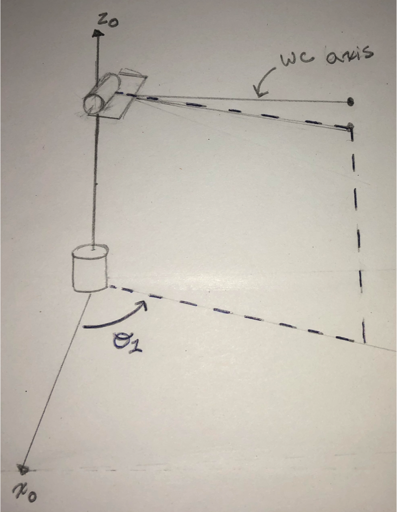
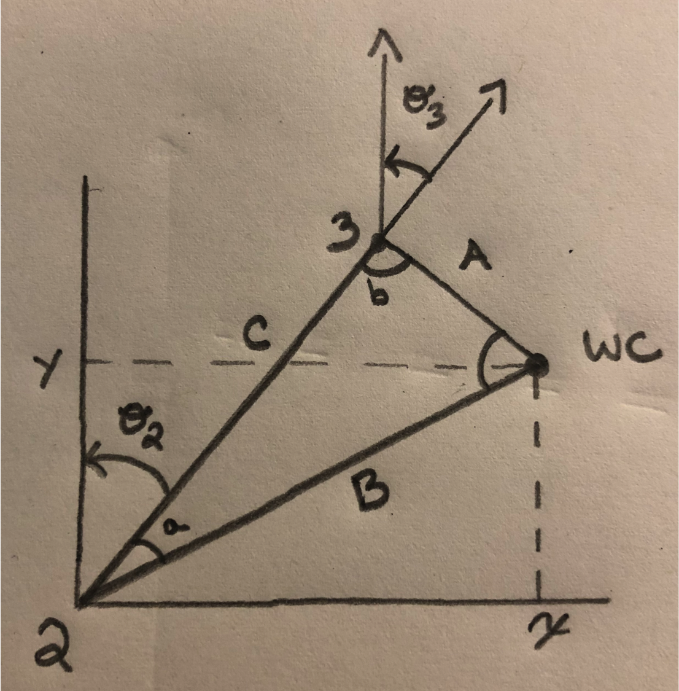
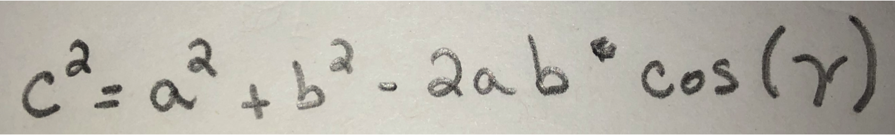

## Project: Kinematics Pick & Place
### The Writeup
In this project, a simulated Kuka KR210 arm targets, picks up, and disposes a can from a shelf to a dropbox.

<div align=center>
	
</div>
<br>

[//]: # (Image References)

[image1]: ./misc_images/misc1.png
[image2]: ./misc_images/misc3.png
[image3]: ./misc_images/misc2.png

### Kinematic Analysis
#### 1. Run the forward_kinematics demo and evaluate the kr210.urdf.xacro file to perform kinematic analysis of Kuka KR210 robot and derive its DH parameters.

The Forward Kinematics (FK) approach calculates the final position and rotation of the end-effector with the parameters of each joint in a series of conjoined links.  The Kuka arm in this project has 6 joints (or 6 degrees of freedom).

Below are a few snippets of code from the kr210.urdf.xacro file:

```
 <!--Links-->
 <link name="base_link">
    <inertial>
      <origin xyz="0 0 0" rpy="0 0 0"/>
      <mass value="${mass0}"/>
      <inertia ixx="60" ixy="0" ixz="0" iyy="70" iyz="0" izz="100"/>
    </inertial>
    <visual>
      <origin xyz="0 0 0" rpy="${-pi/2} 0 0"/>
      <geometry>
        <mesh filename="package://kuka_arm/meshes/kr210l150/visual/base_link.dae"/>
      </geometry>
      <material name="">
        <color rgba="0.75294 0.75294 0.75294 1"/>
      </material>
    </visual>
    <collision>
      <origin xyz="0 0 0" rpy="${-pi/2} 0 0"/>
      <geometry>
        <mesh filename="package://kuka_arm/meshes/kr210l150/collision/base_link.stl"/>
      </geometry>
    </collision>
  </link>
  ...

 <!-- joints -->
  <joint name="fixed_base_joint" type="fixed">
    <parent link="base_footprint"/>
    <child link="base_link"/>
    <origin xyz="0 0 0" rpy="0 0 0"/>
  </joint>
  ...
  
  <!--Transmission and actuators-->
  <transmission name="tran1">
    <type>transmission_interface/SimpleTransmission</type>
    <joint name="joint_1">
      <hardwareInterface>hardware_interface/PositionJointInterface</hardwareInterface>
    </joint>
    <actuator name="motor1">
      <hardwareInterface>hardware_interface/PositionJointInterface</hardwareInterface>
      <mechanicalReduction>1</mechanicalReduction>
    </actuator>
  </transmission>
  ...
```
The data from the kr210.urdf.xacro file (above) is used to derive the DH parameters.


Below is a summary of the DH parameter assignment process:
<br>
<div align=center>
	
</div>
<br> 
Result...
<div align=center>
		
</div>
<br>

A few notes about the kr210.urdf.xacro file... <br>

a1 is the distance between joint 1 and joint 2 -> 0.35. <br>
This is indicated in the kr210.urdf.xacro file: <br>
```
<joint name="joint_2" type="revolute">
 <origin xyz="0.35 0 0.42" rpy="0 0 0"/>
 ```
a2 is the distance between joint 2 and joint 3 along the z axis -> 1.25.
```
<joint name="joint_3" type="revolute">
 <origin xyz="0 0 1.25" rpy="0 0 0"/>
``` 
a3 is the distance between joint 3 and joint 4 along the z axis -> -0.054.
```
<joint name="joint_4" type="revolute">
 <origin xyz="0.96 0 -0.054" rpy="0 0 0"/>
```
d1 is the distane between joint 0 and joint 2 along the z axis.  Therefore the distance between joint 0 to joint 1 and joint 1 to joint 2 is to be added. <br>
0.33 + 0.42 -> 0.75.
```
<joint name="joint_1" type="revolute">
 <origin xyz="0 0 0.33" rpy="0 0 0"/>
 ...
<joint name="joint_2" type="revolute">
 <origin xyz="0.35 0 0.42" rpy="0 0 0"/>
```
d4 is the distance between joint 3 and joint 5 along the x axis. <br>
0.96 + 0.54 -> 1.5.
```
<joint name="joint_4" type="revolute">
 <origin xyz="0.96 0 -0.054" rpy="0 0 0"/>
 ...
<joint name="joint_5" type="revolute">
 <origin xyz="0.54 0 0" rpy="0 0 0"/>
```
dg is the distance between joint 6 and the end effector along the x axis. <br>
0.193 + 0.11 -> 0.303
```
<joint name="joint_6" type="revolute">
 <origin xyz="0.193 0 0" rpy="0 0 0"/>
 ...
<joint name="gripper_joint" type="fixed">
 <parent link="link_6"/>
 <child link="gripper_link"/>
 <origin xyz="0.11 0 0" rpy="0 0 0"/><!--0.087-->
```
note:  Theta, the revolute axis, has **theta 2** corresponding to a turn of -90 degrees.
<br><br>
Behold, the resulting DH parameters table:
<br><br>
<div align=center>
	
</div>
<br>

Here is the DH table in python code:
```
# Create Modified DH parameters (KUKA KR210 DH Parameters)
DH_Table = { alpha0:      0, a0:      0, d1:  0.75, q1:          q1, # i = 1
             alpha1: -pi/2., a1:   0.35, d2:     0, q2: -pi/2. + q2, # i = 2
             alpha2:      0, a2:   1.25, d3:     0, q3:          q3, # i = 3
             alpha3: -pi/2., a3: -0.054, d4:   1.5, q4:          q4, # i = 4
             alpha4:  pi/2., a4:      0, d5:     0, q5:          q5, # i = 5
             alpha5: -pi/2., a5:      0, d6:     0, q6:          q6, # i = 6
             alpha6:      0, a6:      0, d7: 0.303, q7:           0} # i = 7
```

#### 2. Using the DH parameter table you derived earlier, create individual transformation matrices about each joint. 


Here is the theoretical equation to create individual transformation matrices.  As you can see, the DH convention uses four individual transforms:

<div align=center>
	
</div>
<br>
The following matrix will return a homogeneous transformation matrix:

<div align=center>
	
</div>
<br>

Here is the modified DH Transformation matrix in code:
```
# Define Modified DH Transformation matrix
def TF_Matrix(alpha, a, d, q):
    TF = Matrix([[           cos(q),           -sin(q),           0,           	 a],
                [ sin(q)*cos(alpha), cos(q)*cos(alpha), -sin(alpha), -sin(alpha)*d],
                [ sin(q)*sin(alpha), cos(q)*sin(alpha),  cos(alpha),  cos(alpha)*d],
                [                 0,                 0,          0,              1]])
    return TF


# Create individual transformation matrices
# note:  I'm learning through feedback that using subs() is slower than using NumPy and SciPy.  
#        subs() and evalf() are from SymPy.  They are meant to be used for simple evaluation.  
#        subs() and evalf() slow down with larger calculations (moreso than NumPy and SciPy). 
#        I'll keep the subs() function for this project and consider changing next time.   
T0_1  = TF_Matrix(alpha0, a0, d1, q1).subs(DH_Table)
T1_2  = TF_Matrix(alpha1, a1, d2, q2).subs(DH_Table)
T2_3  = TF_Matrix(alpha2, a2, d3, q3).subs(DH_Table)
T3_4  = TF_Matrix(alpha3, a3, d4, q4).subs(DH_Table)
T4_5  = TF_Matrix(alpha4, a4, d5, q5).subs(DH_Table)
T5_6  = TF_Matrix(alpha5, a5, d6, q6).subs(DH_Table)
T6_EE = TF_Matrix(alpha6, a6, d7, q7).subs(DH_Table)

```

In addition, also generate a generalized homogeneous transform between base_link and gripper_link using only end-effector(gripper) pose.
The following code is applied to generate a generalized homogeneous transform using only the end-effector pose:
```
T0_EE = T0_1 * T1_2 * T2_3 * T3_4 * T4_5 * T5_6 * T6_EE
```

An adjustment is required to address a discrepancy between the DH table and the URDF (Universal Robotic Description Format) reference frame. 
The code below creates the correction matrix:
```
# Extract rotation matrices from the transformation matrices
r, p, y = symbols('r p y')

Rot_x = Matrix([[1,      0,       0], 
                [0, cos(r), -sin(r)],
                [0, sin(r), cos(r)]])  # ROLL

Rot_y = Matrix([[cos(p),  0, sin(p)],
                [0,       1,      0],
                [-sin(p), 0, cos(p)]]) # Pitch

Rot_z = Matrix([[cos(y), -sin(y), 0],
                [sin(y),  cos(y), 0],
                [     0,       0, 1]]) # yaw


# Gripper values
Rot_Gripper_x = Rot_x(r)
Rot_Gripper_y = Rot_y(p)
Rot_Gripper_z = Rot_z(y)

# Rotation matrix of end effector (Gripper)
Rot_EE = Rot_Gripper_z * Rot_Gripper_y * Rot_Gripper_x

# Setting up the end effector correction matrix (rotation correction)
Rot_correction = Rot_z(180 * pi/180) * Rot_y(-90 * pi/180)

# Finalizing the adjustment for the discrepancy between the DH table and the URDF reference frame
Rot_EE = Rot_EE * Rot_correction
# note: Rot_EE will be used in the code below when capturing the WC (wrist center)

...

EE = Matrix([px, py, pz])
ROT_EE = ROT_EE.subs({'r': roll, 'p': pitch, 'y': yaw})
WC = EE - (0.303) * ROT_EE[:,2] # DH_Table[d7] = 0.303
```

#### 3. Decouple Inverse Kinematics problem into Inverse Position Kinematics and Inverse Orientation Kinematics; doing so derive the equations to calculate all individual joint angles.

Inverse Kinematics (IK) is the opposite of Forward Kinematics (FK).  IK calculates the parameters of each joint in a series of conjoined links based on the end-effectors coordinate position and rotation. 
The IK problem can be decoupled into **Inverse Position** and **Inverse Orientation** because of a common intersection point.  The intersecting point is joint_5 and is called the wrist center (WC).  <br>
<br>
Below are the steps to solving the inverse kinematics problem: <br>
<br>
**Step 1**: Complete the DH parameter table for the manipulator. <br>
Hint: place the origin of frames 4, 5, and 6 coincident with the WC. <br>

**Step 2**: Find the location of the WC relative to the base frame. Recall that the overall homogeneous transform between the base and end effector has the form,
<div align=center>
	
</div>
</br>
If, for example, you choose z4 parallel to z6 and pointing from the WC to the EE, then this displacement is a simple translation along z6. The magnitude of this displacement, let’s call it d, would depend on the dimensions of the manipulator and are defined in the URDF file. Further, since r13, r23, and r33 define the Z-axis of the EE relative to the base frame, the Cartesian coordinates of the WC is, <br>
<br>
<div align=center>
	
</div>
</br>

**Step 3**: Find joint variables, q1, q2 and q3, such that the WC has coordinates equal to equation (3). This is the hard step. One way to attack the problem is by repeatedly projecting links onto planes and using trigonometry to solve for joint angles. Unfortunately, there is no generic recipe that works for all manipulators so you will have to experiment. The example in the next section will give you some useful guidance. <br>
<br>

**Step 4**: Once the first three joint variables are known, perform the calculations via the application of homogeneous transforms up to the WC. <br>
<br>

**Step 5**: Find a set of Euler angles corresponding to the rotation matrix, <br>
<br>
<div align=center>
	
</div>
<br>

**Step 6**: Choose the correct solution among the set of possible solutions<br>
<br>
**Deriving the equations for individual joint angles**<br>
<br>
Theta 1 - equation and explanation: <br>
<br>
Here is the visual I drew for calculating the theta 1 angle using the WC axis:<br>
<br>
<div align=center>
	
</div>
</br>

The equation below is shown, once again, to display the formula for calculating the wrist center (WC):
<br>
<div align=center>
	
</div>
</br>

```
# First we find the wrist center (joint 5)
WC = EE - (0.303) * ROT_EE[:,2] # DH_Table[d7] = 0.303
	    
# Then we can calculate theta 1
theta1 = atan2(WC[1], WC[0]) # theta1 = atan2(y,x)
```

<br>
Theta 2 & 3 - equation and explanation: <br>
<br>
Because we have information about WC, we are able to use the Law of Cosine to calculate theta 2 & 3.  <br>
<br>
Below is a visual of the data required to capture theta 2 and theta 3: <br>
<br>
<div align=center>
	
</div>
</br>
Here is the Law of Cosine equation that is used: <br>
<br>
<div align=center>
	
</div>
</br>
Here is the code: <br>
<br>

```
# Triangle for theta 2 and theta 3
side_a = 1.501 # DH_Table[d4]
side_b = sqrt(pow((sqrt(WC[0] * WC[0] + WC[1] * WC[1]) - 0.35), 2) + pow((WC[2] - 0.75), 2))
side_c = 1.25 # DH_Table[a2]

angle_a = acos((side_b * side_b + side_c * side_c - side_a * side_a) / (2 * side_b * side_c))
angle_b = acos((side_a * side_a + side_c * side_c - side_b * side_b) / (2 * side_a * side_c))
angle_c = acos((side_a * side_a + side_b * side_b - side_c * side_c) / (2 * side_a * side_b))

theta2 = pi/2 - angle_a - atan2(WC[2] - 0.75, sqrt(WC[0] * WC[0] + WC[1] * WC[1]) - 0.35)
theta3 = pi/2 - (angle_b + 0.036)            # 0.036 accounts for sag on link4 of -0.054m
```

<br>
Theta 4, 5, 6 - equation and explanation: <br>
<br>
For this calculation, we need the overall rotation from the base_link to the gripper link.  
The overall rotation is equal to the product of individual rotations between respective links.
This has already been captured with variable ROT_EE. <br>
<br>
The Euler Angles equation, shown below, will be used to calculate theta 4, 5, and 6: <br>
<br>
<div align=center>
	
</div>
</br>

```
# Get the rotation from joint 3 to the end effector (joint 0 to joint 3)
# We now have the the theta for these joints that define the pose of the wrist center
R0_3 = T0_1[0:3,0:3] * T1_2[0:3,0:3] * T2_3[0:3,0:3]
R0_3_eval = R0_3.evalf(subs={q1 : theta1, q2 : theta2, q3 : theta3})
R3_6 = R0_3_eval.transpose() * ROT_EE

# Theta 4, 5, 6
# Euler angles from rotation matrix
theta4 = atan2(R3_6[2,2], -R3_6[0,2])
theta5 = atan2(sqrt(R3_6[0,2] * R3_6[0,2] + R3_6[2,2] * R3_6[2,2]), R3_6[1,2])
theta6 = atan2(-R3_6[1,1], R3_6[1,0])
```
<br>

### Project Implementation

#### 1. Fill in the `IK_server.py` file with properly commented python code for calculating Inverse Kinematics based on previously performed Kinematic Analysis. 
Your code must guide the robot to successfully complete 8/10 pick and place cycles. 
Briefly discuss the code you implemented and your results. <br>
<br>
<a href="https://github.com/carldgosselin/robotics/blob/master/Project%202%20-%20RoboND-Pick-and-Place/kuka_arm/scripts/IK_server.py"> IK_server.py </a>