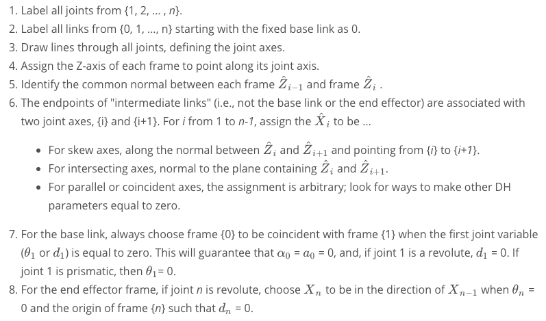
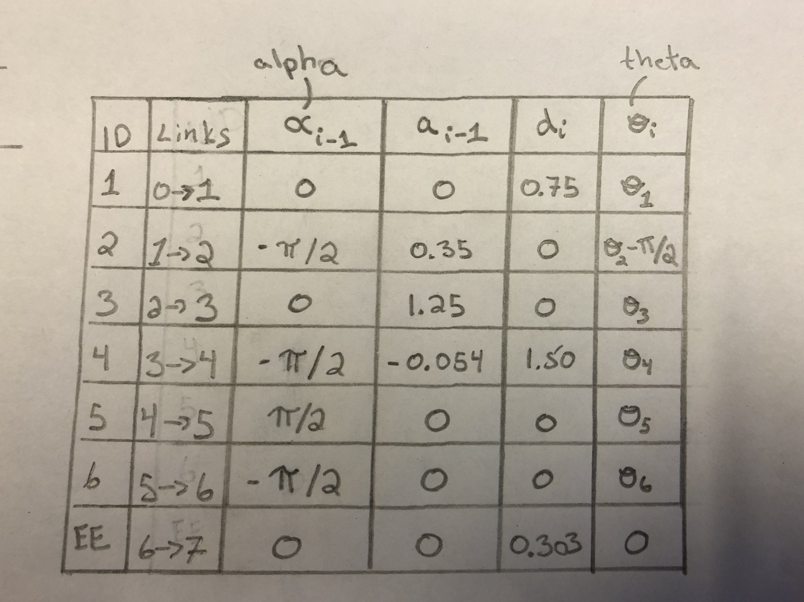

## Project: Kinematics Pick & Place
### The Writeup
In this project, a simulated Kuka KR210 arm targets, picks up, and disposes a can from a shelf to a dropbox.

<div align=center>
	
</div>
<br>

[//]: # (Image References)

[image1]: ./misc_images/misc1.png
[image2]: ./misc_images/misc3.png
[image3]: ./misc_images/misc2.png

### Kinematic Analysis
#### 1. Run the forward_kinematics demo and evaluate the kr210.urdf.xacro file to perform kinematic analysis of Kuka KR210 robot and derive its DH parameters.

Below are a few snippets of code from the kr210.urdf.xacro file:

```
 <!--Links-->
 <link name="base_link">
    <inertial>
      <origin xyz="0 0 0" rpy="0 0 0"/>
      <mass value="${mass0}"/>
      <inertia ixx="60" ixy="0" ixz="0" iyy="70" iyz="0" izz="100"/>
    </inertial>
    <visual>
      <origin xyz="0 0 0" rpy="${-pi/2} 0 0"/>
      <geometry>
        <mesh filename="package://kuka_arm/meshes/kr210l150/visual/base_link.dae"/>
      </geometry>
      <material name="">
        <color rgba="0.75294 0.75294 0.75294 1"/>
      </material>
    </visual>
    <collision>
      <origin xyz="0 0 0" rpy="${-pi/2} 0 0"/>
      <geometry>
        <mesh filename="package://kuka_arm/meshes/kr210l150/collision/base_link.stl"/>
      </geometry>
    </collision>
  </link>
  ...

 <!-- joints -->
  <joint name="fixed_base_joint" type="fixed">
    <parent link="base_footprint"/>
    <child link="base_link"/>
    <origin xyz="0 0 0" rpy="0 0 0"/>
  </joint>
  ...
  
  <!--Transmission and actuators-->
  <transmission name="tran1">
    <type>transmission_interface/SimpleTransmission</type>
    <joint name="joint_1">
      <hardwareInterface>hardware_interface/PositionJointInterface</hardwareInterface>
    </joint>
    <actuator name="motor1">
      <hardwareInterface>hardware_interface/PositionJointInterface</hardwareInterface>
      <mechanicalReduction>1</mechanicalReduction>
    </actuator>
  </transmission>
  ...
```
The data from the kr210.urdf.xacro file (above) is used to derive the DH parameters.


Below is a summary of the DH parameter assignment process:
<br>
<div align=center>
	
</div>
<br> 
Result...
<div align=center>
		
</div>
<br>

A few notes about the kr210.urdf.xacro file... <br>

a1 is the distance between joint 1 and joint 2 -> 0.35. <br>
This is indicated in the kr210.urdf.xacro file: <br>
```
<joint name="joint_2" type="revolute">
 <origin xyz="0.35 0 0.42" rpy="0 0 0"/>
 ```
a2 is the distance between joint 2 and joint 3 along the z axis -> 1.25.
```
<joint name="joint_3" type="revolute">
 <origin xyz="0 0 1.25" rpy="0 0 0"/>
``` 
a3 is the distance between joint 3 and joint 4 along the z axis -> -0.054.
```
<joint name="joint_4" type="revolute">
 <origin xyz="0.96 0 -0.054" rpy="0 0 0"/>
```
d1 is the distane between joint 0 and joint 2 along the z axis.  Therefore the distance between joint 0 to joint 1 and joint 1 to joint 2 is to be added. <br>
0.33 + 0.42 -> 0.75.
```
<joint name="joint_1" type="revolute">
 <origin xyz="0 0 0.33" rpy="0 0 0"/>
 ...
<joint name="joint_2" type="revolute">
 <origin xyz="0.35 0 0.42" rpy="0 0 0"/>
```
d4 is the distance between joint 3 and joint 5 along the x axis. <br>
0.96 + 0.54 -> 1.5.
```
<joint name="joint_4" type="revolute">
 <origin xyz="0.96 0 -0.054" rpy="0 0 0"/>
 ...
<joint name="joint_5" type="revolute">
 <origin xyz="0.54 0 0" rpy="0 0 0"/>
```
dg is the distance between joint 6 and the end effector along the x axis. <br>
0.193 + 0.11 -> 0.303
```
<joint name="joint_6" type="revolute">
 <origin xyz="0.193 0 0" rpy="0 0 0"/>
 ...
<joint name="gripper_joint" type="fixed">
 <parent link="link_6"/>
 <child link="gripper_link"/>
 <origin xyz="0.11 0 0" rpy="0 0 0"/><!--0.087-->
```
note:  Theta, the revolute axis, has **theta 2** corresponding to a turn of -90 degrees.
<br><br>
Behold, the resulting DH parameters table:
<br><br>
<div align=center>
	
</div>
<br>

Here is the DH table in python code:
```
 # DH parameters
    s = {alpha0: 0,     a0:   0,    d1: 0.75,    q1: q1,
         alpha1: -pi/2, a1: 0.35,   d2: 0,       q2: q2 -pi/2,  
         alpha2: 0,     a2: 1.25,   d3: 0,       q3: q3,
         alpha3: -pi/2, a3: -0.054, d4: 1.5,     q4: q4,
         alpha4: pi/2,  a4:   0,    d5: 0,       q5: q5,
         alpha5: -pi/2, a5:   0,    d6: 0,       q6: q6,
         alpha6: 0,     a6:   0,    d7: 0.303,   q7: 0}
```

#### 2. Using the DH parameter table you derived earlier, create individual transformation matrices about each joint. 


In addition, also generate a generalized homogeneous transform between base_link and gripper_link using only end-effector(gripper) pose.
<br>
[placeholder]
<br>


#### 3. Decouple Inverse Kinematics problem into Inverse Position Kinematics and inverse Orientation Kinematics; doing so derive the equations to calculate all individual joint angles.

And here's where you can draw out and show your math for the derivation of your theta angles. 

![alt text][image2]

### Project Implementation

#### 1. Fill in the `IK_server.py` file with properly commented python code for calculating Inverse Kinematics based on previously performed Kinematic Analysis. Your code must guide the robot to successfully complete 8/10 pick and place cycles. Briefly discuss the code you implemented and your results. 


Here I'll talk about the code, what techniques I used, what worked and why, where the implementation might fail and how I might improve it if I were going to pursue this project further.  

