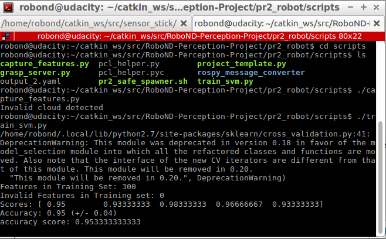

## Exercise 3: object recognition code and pics


# capture_features.py:
```
#!/usr/bin/env python
import numpy as np
import pickle
import rospy

from sensor_stick.pcl_helper import *
from sensor_stick.training_helper import spawn_model
from sensor_stick.training_helper import delete_model
from sensor_stick.training_helper import initial_setup
from sensor_stick.training_helper import capture_sample
from sensor_stick.features import compute_color_histograms
from sensor_stick.features import compute_normal_histograms
from sensor_stick.srv import GetNormals
from geometry_msgs.msg import Pose
from sensor_msgs.msg import PointCloud2


def get_normals(cloud):
    get_normals_prox = rospy.ServiceProxy('/feature_extractor/get_normals', GetNormals)
    return get_normals_prox(cloud).cluster


if __name__ == '__main__':
    rospy.init_node('capture_node')

    # model list for sensor_stick Exercise-3
    # models = [\
    #    'beer',
    #    'bowl',
    #    'create',
    #    'disk_part',
    #    'hammer',
    #    'plastic_cup',
    #    'soda_can']

    # model list for test_world 1
    models = [\
       'biscuits',
       'soap',
       'soap2']

    # model list for test_world 2
    #models = [\
    #   'biscuits',
    #   'soap',
    #   'book',
    #   'soap2',
    #  'glue']

    # model list for test_world 3
    #models = [\
    #  'sticky_notes',
    #  'book',
    #  'snacks',
    #  'biscuits',
    #  'eraser',
    #  'soap2',
    #  'soap',
    #  'glue']

    # Disable gravity and delete the ground plane
    initial_setup()
    labeled_features = []

    for model_name in models:
        spawn_model(model_name)

        for i in range(100):
            # make five attempts to get a valid a point cloud then give up
            sample_was_good = False
            try_count = 0
            while not sample_was_good and try_count < 5:
                sample_cloud = capture_sample()
                sample_cloud_arr = ros_to_pcl(sample_cloud).to_array()

                # Check for invalid clouds.
                if sample_cloud_arr.shape[0] == 0:
                    print('Invalid cloud detected')
                    try_count += 1
                else:
                    sample_was_good = True

            # Extract histogram features
            chists = compute_color_histograms(sample_cloud, using_hsv=True)
            normals = get_normals(sample_cloud)
            nhists = compute_normal_histograms(normals)
            feature = np.concatenate((chists, nhists))
            labeled_features.append([feature, model_name])

        delete_model()


    pickle.dump(labeled_features, open('training_set_3Dperception.sav', 'wb'))

```


# train_svm.py
```
#!/usr/bin/env python
import pickle
import itertools
import numpy as np
import matplotlib.pyplot as plt
from sklearn import svm
from sklearn.preprocessing import LabelEncoder, StandardScaler
from sklearn import cross_validation
from sklearn import metrics

def plot_confusion_matrix(cm, classes,
                          normalize=False,
                          title='Confusion matrix',
                          cmap=plt.cm.Blues):
    """
    This function prints and plots the confusion matrix.
    Normalization can be applied by setting `normalize=True`.
    """
    plt.imshow(cm, interpolation='nearest', cmap=cmap)
    plt.title(title)
    plt.colorbar()
    tick_marks = np.arange(len(classes))
    plt.xticks(tick_marks, classes, rotation=45)
    plt.yticks(tick_marks, classes)

    if normalize:
        cm = cm.astype('float') / cm.sum(axis=1)[:, np.newaxis]

    thresh = cm.max() / 2.
    for i, j in itertools.product(range(cm.shape[0]), range(cm.shape[1])):
        plt.text(j, i, '{0:.2f}'.format(cm[i, j]),
                 horizontalalignment="center",
                 color="white" if cm[i, j] > thresh else "black")

    plt.tight_layout()
    plt.ylabel('True label')
    plt.xlabel('Predicted label')

# Load training data from disk
training_set = pickle.load(open('training_set_3Dperception.sav', 'rb'))

# Format the features and labels for use with scikit learn
feature_list = []
label_list = []

for item in training_set:
    if np.isnan(item[0]).sum() < 1:
        feature_list.append(item[0])
        label_list.append(item[1])

print('Features in Training Set: {}'.format(len(training_set)))
print('Invalid Features in Training set: {}'.format(len(training_set)-len(feature_list)))

X = np.array(feature_list)
# Fit a per-column scaler
X_scaler = StandardScaler().fit(X)
# Apply the scaler to X
X_train = X_scaler.transform(X)
y_train = np.array(label_list)

# Convert label strings to numerical encoding
encoder = LabelEncoder()
y_train = encoder.fit_transform(y_train)

# Create classifier
clf = svm.SVC(kernel='linear')

# Set up 5-fold cross-validation
kf = cross_validation.KFold(len(X_train),
                            n_folds=5,
                            shuffle=True,
                            random_state=1)

# Perform cross-validation
scores = cross_validation.cross_val_score(cv=kf,
                                         estimator=clf,
                                         X=X_train, 
                                         y=y_train,
                                         scoring='accuracy'
                                        )
print('Scores: ' + str(scores))
print('Accuracy: %0.2f (+/- %0.2f)' % (scores.mean(), 2*scores.std()))

# Gather predictions
predictions = cross_validation.cross_val_predict(cv=kf,
                                          estimator=clf,
                                          X=X_train, 
                                          y=y_train
                                         )

accuracy_score = metrics.accuracy_score(y_train, predictions)
print('accuracy score: '+str(accuracy_score))

confusion_matrix = metrics.confusion_matrix(y_train, predictions)

class_names = encoder.classes_.tolist()


#Train the classifier
clf.fit(X=X_train, y=y_train)

model = {'classifier': clf, 'classes': encoder.classes_, 'scaler': X_scaler}

# Save classifier to disk
pickle.dump(model, open('model.sav', 'wb'))

# Plot non-normalized confusion matrix
plt.figure()
plot_confusion_matrix(confusion_matrix, classes=encoder.classes_,
                      title='Confusion matrix, without normalization')

# Plot normalized confusion matrix
plt.figure()
plot_confusion_matrix(confusion_matrix, classes=encoder.classes_, normalize=True,
                      title='Normalized confusion matrix')

plt.show()

```

# Pics (output):

Confusion Matrix for test_world_1
<div align=center>
		
</div>
<br>

SVM score for test_world_1
<div align=center>
		
</div>
<br>

Confusion Matrix for test_world_2
<div align=center>
		
</div>
<br>

SVM score for test_world_2
<div align=center>
		
</div>
<br>

Confusion Matrix for test_world_3
<div align=center>
		
</div>
<br>

SVM score for test_world_3
<div align=center>
		
</div>
<br>

# project_template.py:
```
#!/usr/bin/env python

# Import modules
import numpy as np
import sklearn
from sklearn.preprocessing import LabelEncoder
import pickle
from sensor_stick.srv import GetNormals
from sensor_stick.features import compute_color_histograms
from sensor_stick.features import compute_normal_histograms
from visualization_msgs.msg import Marker
from sensor_stick.marker_tools import *
from sensor_stick.msg import DetectedObjectsArray
from sensor_stick.msg import DetectedObject
from sensor_stick.pcl_helper import *

import rospy
import tf
from geometry_msgs.msg import Pose
from std_msgs.msg import Float64
from std_msgs.msg import Int32
from std_msgs.msg import String
from pr2_robot.srv import *
from rospy_message_converter import message_converter
import yaml
import pcl


# Helper function to get surface normals
def get_normals(cloud):
    get_normals_prox = rospy.ServiceProxy('/feature_extractor/get_normals', GetNormals)
    return get_normals_prox(cloud).cluster

# Helper function to create a yaml friendly dictionary from ROS messages
def make_yaml_dict(test_scene_num, arm_name, object_name, pick_pose, place_pose):
    yaml_dict = {}
    yaml_dict["test_scene_num"] = test_scene_num.data
    yaml_dict["arm_name"]  = arm_name.data
    yaml_dict["object_name"] = object_name.data
    yaml_dict["pick_pose"] = message_converter.convert_ros_message_to_dictionary(pick_pose)
    yaml_dict["place_pose"] = message_converter.convert_ros_message_to_dictionary(place_pose)
    return yaml_dict

# Helper function to output to yaml file
def send_to_yaml(yaml_filename, dict_list):
    data_dict = {"object_list": dict_list}
    with open(yaml_filename, 'w') as outfile:
        yaml.dump(data_dict, outfile, default_flow_style=False)

# Callback function for your Point Cloud Subscriber
def pcl_callback(pcl_msg):

# Exercise-2 TODOs:

    # TODO: Convert ROS msg to PCL data
    cloud = ros_to_pcl(pcl_msg)

    # Statistical Outlier Filtering
    fil = cloud.make_statistical_outlier_filter()
    fil.set_mean_k(20)
    fil.set_std_dev_mul_thresh(0.3)
    filtered_cloud = fil.filter()

    # TODO: Voxel Grid Downsampling
    # Create a VoxelGrid filter object for our input point cloud
    vox = filtered_cloud.make_voxel_grid_filter()
    
    # Set the voxel (or leaf) size..
    LEAF_SIZE = 0.01
    vox.set_leaf_size(LEAF_SIZE, LEAF_SIZE, LEAF_SIZE)

    # Call the filter function to obtain the resultant downsampled point cloud
    cloud_filtered = vox.filter()

    # TODO: PassThrough Filter
    # Create a PassThrough filter object.
    passthrough = cloud_filtered.make_passthrough_filter()

    # Assign axis and range to the passthrough filter object.
    filter_axis = 'z'
    passthrough.set_filter_field_name (filter_axis)
    axis_min = 0.75
    axis_max = 1.1
    passthrough.set_filter_limits (axis_min, axis_max)

    # Finally use the filter function to obtain the resultant point cloud..
    cloud_filtered = passthrough.filter()

    # TODO: RANSAC Plane Segmentation
    # Create the segmentation object
    seg = cloud_filtered.make_segmenter()

    # Set the model you wish to fit.
    seg.set_model_type(pcl.SACMODEL_PLANE)
    seg.set_method_type(pcl.SAC_RANSAC)

    # Max distance for a point to be considered fitting the model
    # Experiment with different values for max_distance.
    # for segmenting the table
    max_distance = 0.02
    seg.set_distance_threshold(max_distance)

    # Call the segment function to obtain set of inlier indices and model coefficients
    inliers, coefficients = seg.segment()

    # TODO: Extract inliers and outliers

    cloud_table = cloud_filtered.extract(inliers, negative=False)
    cloud_objects = cloud_filtered.extract(inliers, negative=True)

    # TODO: Euclidean Clustering
    white_cloud = XYZRGB_to_XYZ(cloud_objects)# Apply function to convert XYZRGB to XYZ
    tree = white_cloud.make_kdtree()

    # TODO: Create Cluster-Mask Point Cloud to visualize each cluster separately
    # Create a cluster extraction object
    ec = white_cloud.make_EuclideanClusterExtraction()
    # Set tolerances for distance threshold.
    # as well as minimum and maximum cluster size (in points)
    # NOTE: These are poor choices of clustering parameters
    # Your task is to experiment and find values that work for segmenting objects.
    ec.set_ClusterTolerance(0.05)
    ec.set_MinClusterSize(5)
    ec.set_MaxClusterSize(2000)
    # Search the k-d tree for clusters
    ec.set_SearchMethod(tree)
    # Extract indices for each of the discovered clusters
    cluster_indices = ec.Extract()

    #Assign a color corresponding to each segmented object in scene
    cluster_color = get_color_list(len(cluster_indices))

    color_cluster_point_list = []

    for j, indices in enumerate(cluster_indices):
        for i, indice in enumerate(indices):
            color_cluster_point_list.append([white_cloud[indice][0],
                                            white_cloud[indice][1],
                                            white_cloud[indice][2],
                                             rgb_to_float(cluster_color[j])])

    #Create new cloud containing all clusters, each with unique color
    cluster_cloud = pcl.PointCloud_PointXYZRGB()
    cluster_cloud.from_list(color_cluster_point_list)

    # TODO: Convert PCL data to ROS messages
    ros_cloud_objects = pcl_to_ros(cloud_objects)
    ros_cloud_table = pcl_to_ros(cloud_table)
    ros_cluster_cloud = pcl_to_ros(cluster_cloud)

    # TODO: Publish ROS messages
    pcl_objects_pub.publish(ros_cloud_objects)
    pcl_table_pub.publish(ros_cloud_table)
    pcl_cluster_pub.publish(ros_cluster_cloud)

# Exercise-3 TODOs:

    # Classify the clusters! (loop through each detected cluster one at a time)

    detected_objects_labels = []
    detected_objects = []

    for index, pts_list in enumerate(cluster_indices):
        # Grab the points for the cluster
        pcl_cluster = cloud_objects.extract(pts_list)
        # TODO: convert the cluster from pcl to ROS using helper function
        ros_cluster = pcl_to_ros(pcl_cluster)
        # Extract histogram features
        # TODO: complete this step just as you did before in capture_features.py
        chists = compute_color_histograms(ros_cluster, using_hsv=True)
        normals = get_normals(ros_cluster)
        nhists = compute_normal_histograms(normals)
        feature = np.concatenate((chists, nhists))

        # Make the prediction, retrieve the label for the result
        # and add it to detected_objects_labels list
        prediction = clf.predict(scaler.transform(feature.reshape(1,-1)))
        label = encoder.inverse_transform(prediction)[0]
        detected_objects_labels.append(label)

        # Publish a label into RViz
        label_pos = list(white_cloud[pts_list[0]])
        label_pos[2] += .4
        object_markers_pub.publish(make_label(label,label_pos, index))

        # Add the detected object to the list of detected objects.
        do = DetectedObject()
        do.label = label
        do.cloud = ros_cluster
        detected_objects.append(do)

    rospy.loginfo('Detected {} objects: {}'.format(len(detected_objects_labels), detected_objects_labels))

    # Publish the list of detected objects
    # This is the output you'll need to complete the upcoming project!
    detected_objects_pub.publish(detected_objects)

    # Suggested location for where to invoke your pr2_mover() function within pcl_callback()
    # Could add some logic to determine whether or not your object detections are robust
    # before calling pr2_mover()
    try:
        # pr2_mover(detected_objects_list)
	pr2_mover(detected_objects)
    except rospy.ROSInterruptException:
        pass

# function to load parameters and request PickPlace service
def pr2_mover(object_list):

    # TODO: Initialize variables
    dict_list = []
    centroids = [] # to be list of tuples (x, y, z)

    # TODO: Get/Read parameters
    object_list_param = rospy.get_param('/object_list')
    dropbox_param = rospy.get_param('/dropbox')

    # TODO: Parse parameters into individual variables
    dict_dropbox = {}
    for p in dropbox_param:
        dict_dropbox[p['name']] = p['position']

    #print (dict_dropbox["left"])
    #print (dict_dropbox["right"])

    # TODO: Rotate PR2 in place to capture side tables for the collision map

    # TODO: Loop through the pick list
    for obj in object_list_param:
        

        # TODO: Get the PointCloud for a given object and obtain it's centroid
        object_name = String()
        object_name.data = obj['name']
        #print(object_list[object_name])

        #set default value of pick_pose in case the object can't be found
        pick_pose = Pose()
        pick_pose.position.x = 0
        pick_pose.position.y = 0
        pick_pose.position.z = 0

        #set orientation to 0
        pick_pose.orientation.x = 0
        pick_pose.orientation.y = 0
        pick_pose.orientation.z = 0
        pick_pose.orientation.w = 0

        #set place pose orientation to 0
        place_pose = Pose()
        place_pose.orientation.x = 0
        place_pose.orientation.y = 0
        place_pose.orientation.z = 0
        place_pose.orientation.w = 0

        #print(object_name)
        for detected_object in object_list:
            if detected_object.label == object_name.data:
                #print(object_name)

                # TODO: Create 'place_pose' for the object
                #labels.append(object.label)
                points_arr = ros_to_pcl(detected_object.cloud).to_array()
                #centroids.append(np.mean(points_arr, axis=0)[:3])
                pick_pose_np = np.mean(points_arr, axis=0)[:3]
                #pick_pose.position = [np.asscalar(pick_pose_np[0]), np.asscalar(pick_pose_np[1]), np.asscalar(pick_pose_np[2])]
                pick_pose.position.x = np.asscalar(pick_pose_np[0])
                pick_pose.position.y = np.asscalar(pick_pose_np[1])
                pick_pose.position.z = np.asscalar(pick_pose_np[2])
                #print(pick_pose.position)
                break


        # TODO: Assign the arm to be used for pick_place
        arm_name = String()
        if obj['group'] == 'red':
            arm_name.data = 'left'
        elif obj['group'] == 'green':
            arm_name.data = 'right'
        else:
            print "ERROR, group must be green or red!"


        # TODO: Create a list of dictionaries (made with make_yaml_dict()) for later output to yaml format
        test_scene_num = Int32()
        test_scene_num.data = 3

        place_pose.position.x = dict_dropbox[arm_name.data][0]
        place_pose.position.y = dict_dropbox[arm_name.data][1]
        place_pose.position.z = dict_dropbox[arm_name.data][2]
        dict_list.append(make_yaml_dict(test_scene_num, arm_name, object_name, pick_pose, place_pose))

        # Wait for 'pick_place_routine' service to come up
        rospy.wait_for_service('pick_place_routine')

        # try:
        #     pick_place_routine = rospy.ServiceProxy('pick_place_routine', PickPlace)

        #     # TODO: Insert your message variables to be sent as a service request
        #     resp = pick_place_routine(TEST_SCENE_NUM, OBJECT_NAME, WHICH_ARM, PICK_POSE, PLACE_POSE)

        #     print ("Response: ",resp.success)

        # except rospy.ServiceException, e:
        #     print "Service call failed: %s"%e

    # TODO: Output your request parameters into output yaml file
    yaml_filename = "output_" + str(test_scene_num.data) + ".yaml"

    send_to_yaml(yaml_filename, dict_list)


if __name__ == '__main__':

    # TODO: ROS node initialization
    rospy.init_node('clustering', anonymous=True)
    # TODO: Create Subscribers
    pcl_sub = rospy.Subscriber("/pr2/world/points", pc2.PointCloud2, pcl_callback, queue_size=1)
    # TODO: Create Publishers
    pcl_objects_pub = rospy.Publisher("/pcl_objects", PointCloud2, queue_size=1)
    pcl_table_pub = rospy.Publisher("/pcl_table", PointCloud2, queue_size=1)
    pcl_cluster_pub = rospy.Publisher("/pcl_cluster", PointCloud2, queue_size=1)

    object_markers_pub = rospy.Publisher("/object_markers", Marker, queue_size=1)
    detected_objects_pub = rospy.Publisher("/detected_objects", DetectedObjectsArray, queue_size=1)
    # TODO: Load Model From disk
    model = pickle.load(open('model.sav', 'rb'))
    clf = model['classifier']
    encoder = LabelEncoder()
    encoder.classes_ = model['classes']
    scaler = model['scaler']
    # Initialize color_list
    get_color_list.color_list = []

    # TODO: Spin while node is not shutdown
    while not rospy.is_shutdown():
        rospy.spin()
```

so... not sure where to go from here <br>
Running "roslaunch pr2_robot robot_spawn.launch" only produces the pr2 robot in Gazebo and RVIZ does not even launch <br>
The robot_spawn.launch files are different between sensor_stick and pr2. <br>
<br>

<div align=center>
	<br>
	???
</div>
<br>