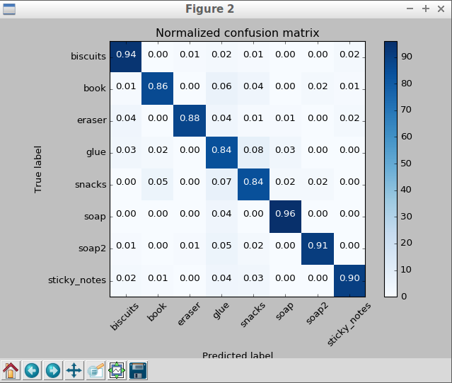
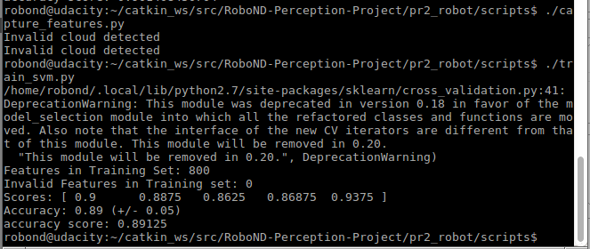

## Exercise 3: object recognition code and pics


# capture_features.py:
```
#!/usr/bin/env python
import numpy as np
import pickle
import rospy

from sensor_stick.pcl_helper import *
from sensor_stick.training_helper import spawn_model
from sensor_stick.training_helper import delete_model
from sensor_stick.training_helper import initial_setup
from sensor_stick.training_helper import capture_sample
from sensor_stick.features import compute_color_histograms
from sensor_stick.features import compute_normal_histograms
from sensor_stick.srv import GetNormals
from geometry_msgs.msg import Pose
from sensor_msgs.msg import PointCloud2


def get_normals(cloud):
    get_normals_prox = rospy.ServiceProxy('/feature_extractor/get_normals', GetNormals)
    return get_normals_prox(cloud).cluster


if __name__ == '__main__':
    rospy.init_node('capture_node')

    # model list for sensor_stick Exercise-3
    # models = [\
    #    'beer',
    #    'bowl',
    #    'create',
    #    'disk_part',
    #    'hammer',
    #    'plastic_cup',
    #    'soda_can']

    # model list for test_world 1
    models = [\
       'biscuits',
       'soap',
       'soap2']

    # model list for test_world 2
    #models = [\
    #   'biscuits',
    #   'soap',
    #   'book',
    #   'soap2',
    #  'glue']

    # model list for test_world 3
    #models = [\
    #  'sticky_notes',
    #  'book',
    #  'snacks',
    #  'biscuits',
    #  'eraser',
    #  'soap2',
    #  'soap',
    #  'glue']

    # Disable gravity and delete the ground plane
    initial_setup()
    labeled_features = []

    for model_name in models:
        spawn_model(model_name)

        for i in range(100):
            # make five attempts to get a valid a point cloud then give up
            sample_was_good = False
            try_count = 0
            while not sample_was_good and try_count < 5:
                sample_cloud = capture_sample()
                sample_cloud_arr = ros_to_pcl(sample_cloud).to_array()

                # Check for invalid clouds.
                if sample_cloud_arr.shape[0] == 0:
                    print('Invalid cloud detected')
                    try_count += 1
                else:
                    sample_was_good = True

            # Extract histogram features
            chists = compute_color_histograms(sample_cloud, using_hsv=True)
            normals = get_normals(sample_cloud)
            nhists = compute_normal_histograms(normals)
            feature = np.concatenate((chists, nhists))
            labeled_features.append([feature, model_name])

        delete_model()


    pickle.dump(labeled_features, open('training_set_3Dperception.sav', 'wb'))

```


# train_svm.py
```
#!/usr/bin/env python
import pickle
import itertools
import numpy as np
import matplotlib.pyplot as plt
from sklearn import svm
from sklearn.preprocessing import LabelEncoder, StandardScaler
from sklearn import cross_validation
from sklearn import metrics

def plot_confusion_matrix(cm, classes,
                          normalize=False,
                          title='Confusion matrix',
                          cmap=plt.cm.Blues):
    """
    This function prints and plots the confusion matrix.
    Normalization can be applied by setting `normalize=True`.
    """
    plt.imshow(cm, interpolation='nearest', cmap=cmap)
    plt.title(title)
    plt.colorbar()
    tick_marks = np.arange(len(classes))
    plt.xticks(tick_marks, classes, rotation=45)
    plt.yticks(tick_marks, classes)

    if normalize:
        cm = cm.astype('float') / cm.sum(axis=1)[:, np.newaxis]

    thresh = cm.max() / 2.
    for i, j in itertools.product(range(cm.shape[0]), range(cm.shape[1])):
        plt.text(j, i, '{0:.2f}'.format(cm[i, j]),
                 horizontalalignment="center",
                 color="white" if cm[i, j] > thresh else "black")

    plt.tight_layout()
    plt.ylabel('True label')
    plt.xlabel('Predicted label')

# Load training data from disk
training_set = pickle.load(open('training_set_3Dperception.sav', 'rb'))

# Format the features and labels for use with scikit learn
feature_list = []
label_list = []

for item in training_set:
    if np.isnan(item[0]).sum() < 1:
        feature_list.append(item[0])
        label_list.append(item[1])

print('Features in Training Set: {}'.format(len(training_set)))
print('Invalid Features in Training set: {}'.format(len(training_set)-len(feature_list)))

X = np.array(feature_list)
# Fit a per-column scaler
X_scaler = StandardScaler().fit(X)
# Apply the scaler to X
X_train = X_scaler.transform(X)
y_train = np.array(label_list)

# Convert label strings to numerical encoding
encoder = LabelEncoder()
y_train = encoder.fit_transform(y_train)

# Create classifier
clf = svm.SVC(kernel='linear')

# Set up 5-fold cross-validation
kf = cross_validation.KFold(len(X_train),
                            n_folds=5,
                            shuffle=True,
                            random_state=1)

# Perform cross-validation
scores = cross_validation.cross_val_score(cv=kf,
                                         estimator=clf,
                                         X=X_train, 
                                         y=y_train,
                                         scoring='accuracy'
                                        )
print('Scores: ' + str(scores))
print('Accuracy: %0.2f (+/- %0.2f)' % (scores.mean(), 2*scores.std()))

# Gather predictions
predictions = cross_validation.cross_val_predict(cv=kf,
                                          estimator=clf,
                                          X=X_train, 
                                          y=y_train
                                         )

accuracy_score = metrics.accuracy_score(y_train, predictions)
print('accuracy score: '+str(accuracy_score))

confusion_matrix = metrics.confusion_matrix(y_train, predictions)

class_names = encoder.classes_.tolist()


#Train the classifier
clf.fit(X=X_train, y=y_train)

model = {'classifier': clf, 'classes': encoder.classes_, 'scaler': X_scaler}

# Save classifier to disk
pickle.dump(model, open('model.sav', 'wb'))

# Plot non-normalized confusion matrix
plt.figure()
plot_confusion_matrix(confusion_matrix, classes=encoder.classes_,
                      title='Confusion matrix, without normalization')

# Plot normalized confusion matrix
plt.figure()
plot_confusion_matrix(confusion_matrix, classes=encoder.classes_, normalize=True,
                      title='Normalized confusion matrix')

plt.show()

```

# Pics (output):

Confusion Matrix for test_world_1
<div align=center>
		
</div>
<br>

SVM score for test_world_1
<div align=center>
		
</div>
<br>

Confusion Matrix for test_world_2
<div align=center>
		
</div>
<br>

SVM score for test_world_2
<div align=center>
		
</div>
<br>

Confusion Matrix for test_world_3
<div align=center>
		
</div>
<br>

SVM score for test_world_3
<div align=center>
		
</div>
<br>

# project_template.py:
```

```