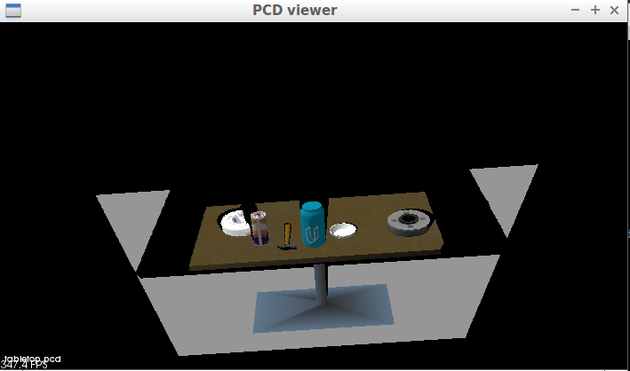
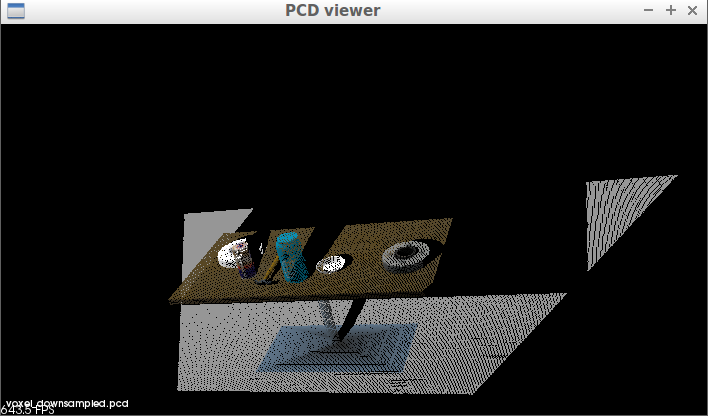
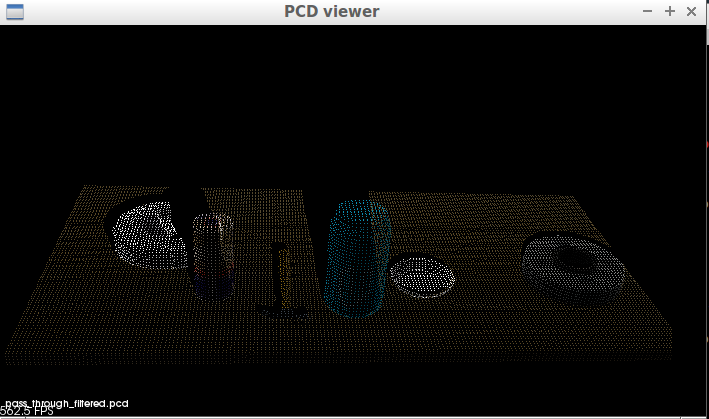
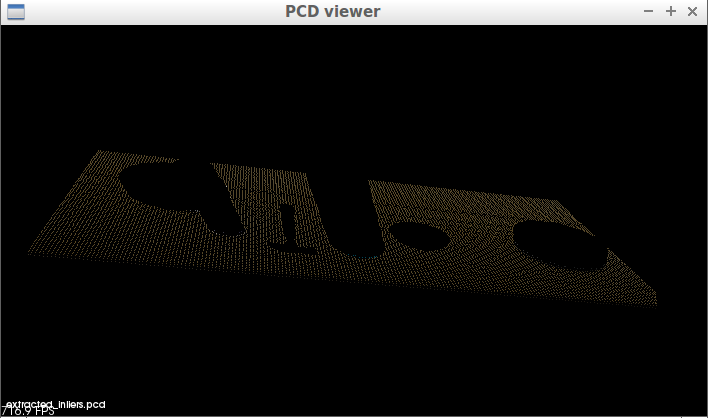
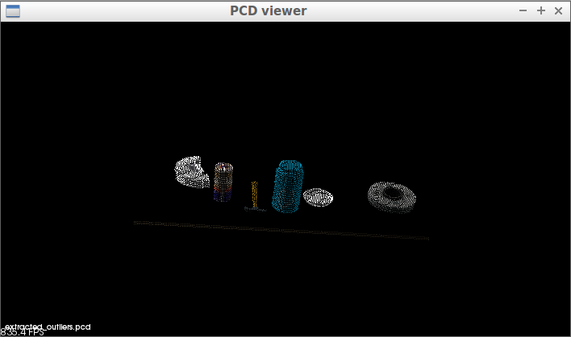
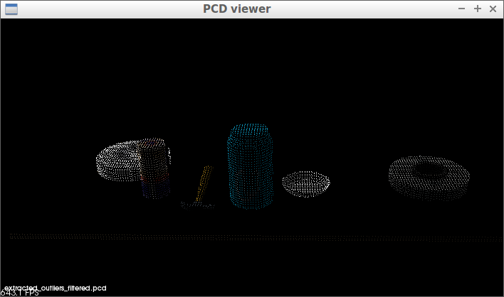

## Exercise 1: tabletop segmentation code & point cloud data pics

# Code:
```
#!/usr/bin/env python

# Import modules
from pcl_helper import *

# TODO: Define functions as required

# Callback function for your Point Cloud Subscriber
def pcl_callback(pcl_msg):

    # TODO: Convert ROS msg to PCL data
    cloud = ros_to_pcl(pcl_msg)

    # TODO: Voxel Grid Downsampling
    vox = cloud.make_voxel_grid_filter()
    # voxel aka leaf
    LEAF_SIZE = 0.01
    vox.set_leaf_size(LEAF_SIZE, LEAF_SIZE, LEAF_SIZE)
    # Obtain the resulting downsampled point cloud
    cloud_filtered = vox.filter()

    # TODO: PassThrough Filter
    # Create a passthrough filter object
    passthrough = cloud_filtered.make_passthrough_filter()
    # Assign axis and range to the passthrough filter object
    passthrough.set_filter_field_name('z')
    axis_min = 0.75
    axis_max = 1.1
    passthrough.set_filter_limits(axis_min, axis_max)
    # Finally, use the filter to obtain the resultant point cloud
    cloud_filtered = passthrough.filter()

    # TODO: RANSAC Plane Segmentation
    # Create the segmentation object
    seg = cloud_filtered.make_segmenter()
    # Set the model to fit
    seg.set_model_type(pcl.SACMODEL_PLANE)
    seg.set_method_type(pcl.SAC_RANSAC)
    # Max distance for a point to be considered fitting the model
    max_distance = 0.01
    seg.set_distance_threshold(max_distance)
    # Call the segment function to obtain set of inlier indices and model coefficients
    inliers, coefficients = seg.segment()

    # TODO: Extract inliers and outliers
    # inliers -> positive (negative=False)
    cloud_table = cloud_filtered.extract(inliers, negative=False)
    # outliers -> negative (negative=True)
    cloud_objects = cloud_filtered.extract(inliers, negative=True)

    # TODO: Euclidean Clustering
    # First, construct a k-d tree from the cloud_objects point cloud.
    # This is used to reduce computation burden of searching for neighboring points.
    # PCL's Enclidian Clustering algorithm only support k-d trees
    # A colorless cloud is created when conerting XYZRGB to XYZ (spatial info only).  Hence the name white_cloud
    white_cloud = XYZRGB_to_XYZ(cloud_objects)  # Apply function to convert XYZRGB to XYZ
    tree = white_cloud.make_kdtree()

    # Create a cluster extraction object
    ec = white_cloud.make_EuclideanClusterExtraction()

    # Set tolerances for distance threshold 
    # as well as minimum and maximum cluster size (in points)
    # NOTE: These are poor choices of clustering parameters
    # Your task is to experiment and find values that work for segmenting objects.
    ec.set_ClusterTolerance(0.014)
    ec.set_MinClusterSize(20)
    ec.set_MaxClusterSize(2050)

    # Search the k-d tree for clusters
    ec.set_SearchMethod(tree)

    # Extract indices for each of the discovered clusters
    cluster_indices = ec.Extract()

    # Cluser visualization with RViz
    # Assign a color corresponding to each segmented object in the scene
    cluster_color = get_color_list(len(cluster_indices))
    color_cluster_point_list = []
    for j, indices in enumerate(cluster_indices):
        for i, indice in enumerate(indices):
            color_cluster_point_list.append([white_cloud[indice][0],
                                             white_cloud[indice][1],
                                             white_cloud[indice][2],
                                             rgb_to_float(cluster_color[j])])


    # TODO: Create Cluster-Mask Point Cloud to visualize each cluster separately
    # Create new cloud containing all clusters, each with a unique color
    cluster_cloud = pcl.PointCloud_PointXYZRGB()
    cluster_cloud.from_list(color_cluster_point_list)

    # TODO: Convert PCL data to ROS messages
    #ros_cloud_object_cluster = pcl_to_ros(cluster_cloud)
    ros_cloud_objects = pcl_to_ros(cloud_objects)
    ros_cloud_table = pcl_to_ros(cloud_table)
    ros_cluster_cloud = pcl_to_ros(cluster_cloud)

    # TODO: Publish ROS messages
    #pcl_objects_cloud_pub.publish(ros_cloud_object_cluster)
    pcl_objects_pub.publish(ros_cloud_objects)
    pcl_table_pub.publish(ros_cloud_table)
    pcl_cluster_pub.publish(ros_cluster_cloud)

if __name__ == '__main__':

    # TODO: ROS node initialization

    rospy.init_node('clustering', anonymous=True)

    # TODO: Create Subscribers
    pcl_sub = rospy.Subscriber("/sensor_stick/point_cloud", pc2.PointCloud2, pcl_callback, queue_size=1)

    # TODO: Create Publishers
    pcl_objects_pub = rospy.Publisher("/pcl_objects", PointCloud2, queue_size=1)
    pcl_table_pub = rospy.Publisher("/pcl_table", PointCloud2, queue_size=1)
    pcl_cluster_pub = rospy.Publisher("/pcl_cluster", PointCloud2, queue_size = 1)

    # Initialize color_list
    get_color_list.color_list = []

    # TODO: Spin while node is not shutdown
    while not rospy.is_shutdown():
        rospy.spin()

```

# Pics (output):

tabletop.pcd
<div align=center>
		
</div>
<br>

voxel_downsampled.pcd
<div align=center>
		
</div>
<br>

pass_through_filtered.pcd
<div align=center>
		
</div>
<br>

extracted_inliers.pcd
<div align=center>
		
</div>
<br>

extracted_outliers.pcd
<div align=center>
		
</div>
<br>

extracted_outliers_filtered.pcd
<div align=center>
		
</div>
<br>
