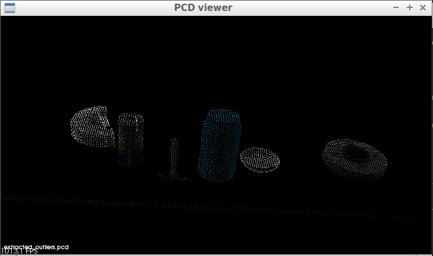

## Exercise 1: tabletop segmentation code & point cloud data pics

# Code:
```
# placeholder

```

# Pics (output):

tabletop.pcd
<div align=center>
		
</div>
<br>

voxel_downsampled.pcd
<div align=center>
		
</div>
<br>

pass_through_filtered.pcd
<div align=center>
		
</div>
<br>

extracted_inliers.pcd
<div align=center>
		
</div>
<br>

extracted_outliers.pcd
<div align=center>
		
</div>
<br>

extracted_outliers_filtered.pcd
<div align=center>
		
</div>
<br>
