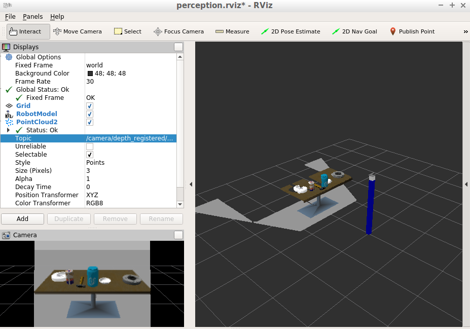
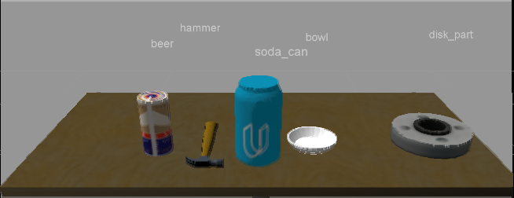
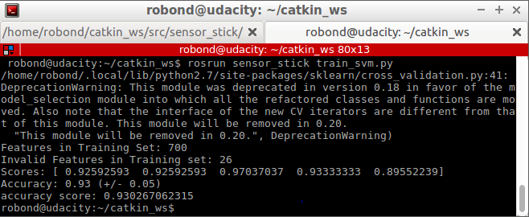
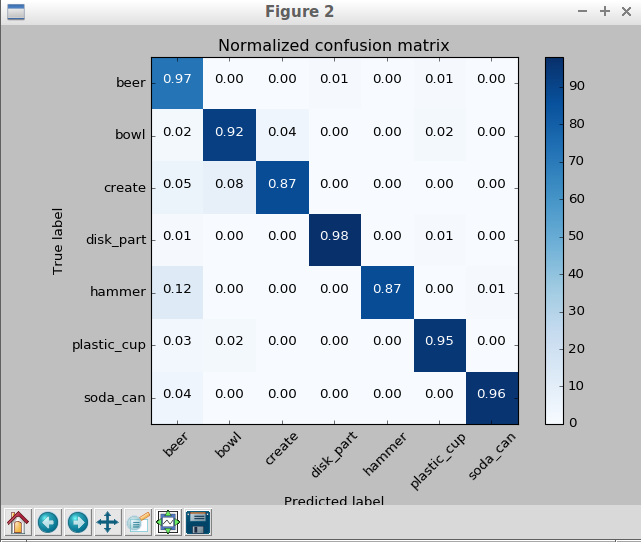

## Exercise 3: object recognition code and pics

# object_recognition.py:
```
#!/usr/bin/env python

import numpy as np
import sklearn
from sklearn.preprocessing import LabelEncoder

import pickle

from sensor_stick.srv import GetNormals
from sensor_stick.features import compute_color_histograms
from sensor_stick.features import compute_normal_histograms
from visualization_msgs.msg import Marker

from sensor_stick.marker_tools import *
from sensor_stick.msg import DetectedObjectsArray
from sensor_stick.msg import DetectedObject
from sensor_stick.pcl_helper import *

def get_normals(cloud):
    get_normals_prox = rospy.ServiceProxy('/feature_extractor/get_normals', GetNormals)
    return get_normals_prox(cloud).cluster

# Callback function for your Point Cloud Subscriber
def pcl_callback(pcl_msg):

# Exercise-2 TODOs:

    # TODO: Convert ROS msg to PCL data
    cloud = ros_to_pcl(pcl_msg)
    # TODO: Voxel Grid Downsampling

    # Create a VoxelGrid filter object for our input point cloud
    vox = cloud.make_voxel_grid_filter()
    # Set the voxel (or leaf) size..
    LEAF_SIZE = 0.01
    vox.set_leaf_size(LEAF_SIZE, LEAF_SIZE, LEAF_SIZE)

    # Call the filter function to obtain the resultant downsampled point cloud
    cloud_filtered = vox.filter()

    # TODO: PassThrough Filter
    # Create a PassThrough filter object.
    passthrough = cloud_filtered.make_passthrough_filter()

    # Assign axis and range to the passthrough filter object.
    filter_axis = 'z'
    passthrough.set_filter_field_name (filter_axis)
    axis_min = 0.75
    axis_max = 1.1
    passthrough.set_filter_limits (axis_min, axis_max)

    # Finally use the filter function to obtain the resultant point cloud..
    cloud_filtered = passthrough.filter()

    # TODO: RANSAC Plane Segmentation
    # Create the segmentation object
    seg = cloud_filtered.make_segmenter()

    # Set the model you wish to fit.
    seg.set_model_type(pcl.SACMODEL_PLANE)
    seg.set_method_type(pcl.SAC_RANSAC)

    # Max distance for a point to be considered fitting the model
    # Experiment with different values for max_distance.
    # for segmenting the table
    max_distance = 0.02
    seg.set_distance_threshold(max_distance)

    # Call the segment function to obtain set of inlier indices and model coefficients
    inliers, coefficients = seg.segment()

    # TODO: Extract inliers and outliers

    cloud_table = cloud_filtered.extract(inliers, negative=False)
    cloud_objects = cloud_filtered.extract(inliers, negative=True)

    # TODO: Euclidean Clustering
    white_cloud = XYZRGB_to_XYZ(cloud_objects)# Apply function to convert XYZRGB to XYZ
    tree = white_cloud.make_kdtree()

    # TODO: Create Cluster-Mask Point Cloud to visualize each cluster separately
    # Create a cluster extraction object
    ec = white_cloud.make_EuclideanClusterExtraction()
    # Set tolerances for distance threshold.
    # as well as minimum and maximum cluster size (in points)
    # NOTE: These are poor choices of clustering parameters
    # Your task is to experiment and find values that work for segmenting objects.
    ec.set_ClusterTolerance(0.05)
    ec.set_MinClusterSize(5)
    ec.set_MaxClusterSize(2000)
    # Search the k-d tree for clusters
    ec.set_SearchMethod(tree)
    # Extract indices for each of the discovered clusters
    cluster_indices = ec.Extract()

    #Assign a color corresponding to each segmented object in scene
    cluster_color = get_color_list(len(cluster_indices))

    color_cluster_point_list = []

    for j, indices in enumerate(cluster_indices):
        for i, indice in enumerate(indices):
            color_cluster_point_list.append([white_cloud[indice][0],
                                            white_cloud[indice][1],
                                            white_cloud[indice][2],
                                             rgb_to_float(cluster_color[j])])

    #Create new cloud containing all clusters, each with unique color
    cluster_cloud = pcl.PointCloud_PointXYZRGB()
    cluster_cloud.from_list(color_cluster_point_list)

    # TODO: Convert PCL data to ROS messages
    ros_cloud_objects = pcl_to_ros(cloud_objects)
    ros_cloud_table = pcl_to_ros(cloud_table)
    ros_cluster_cloud = pcl_to_ros(cluster_cloud)

    # TODO: Publish ROS messages
    pcl_objects_pub.publish(ros_cloud_objects)
    pcl_table_pub.publish(ros_cloud_table)
    pcl_cluster_pub.publish(ros_cluster_cloud)

# Exercise-3 TODOs:

    # Classify the clusters! (loop through each detected cluster one at a time)

    detected_objects_labels = []
    detected_objects = []

    for index, pts_list in enumerate(cluster_indices):
        # Grab the points for the cluster
        pcl_cluster = cloud_objects.extract(pts_list)
        # TODO: convert the cluster from pcl to ROS using helper function
        ros_cluster = pcl_to_ros(pcl_cluster)
        # Extract histogram features
        # TODO: complete this step just as you did before in capture_features.py
        chists = compute_color_histograms(ros_cluster, using_hsv=True)
        normals = get_normals(ros_cluster)
        nhists = compute_normal_histograms(normals)
        feature = np.concatenate((chists, nhists))

        # Make the prediction, retrieve the label for the result
        # and add it to detected_objects_labels list
        prediction = clf.predict(scaler.transform(feature.reshape(1,-1)))
        label = encoder.inverse_transform(prediction)[0]
        detected_objects_labels.append(label)

        # Publish a label into RViz
        label_pos = list(white_cloud[pts_list[0]])
        label_pos[2] += .4
        object_markers_pub.publish(make_label(label,label_pos, index))

        # Add the detected object to the list of detected objects.
        do = DetectedObject()
        do.label = label
        do.cloud = ros_cluster
        detected_objects.append(do)

    rospy.loginfo('Detected {} objects: {}'.format(len(detected_objects_labels), detected_objects_labels))

    # Publish the list of detected objects
    # This is the output you'll need to complete the upcoming project!
    detected_objects_pub.publish(detected_objects)

if __name__ == '__main__':

    # TODO: ROS node initialization
    rospy.init_node('clustering', anonymous=True)
    # TODO: Create Subscribers
    pcl_sub = rospy.Subscriber("/sensor_stick/point_cloud", pc2.PointCloud2, pcl_callback, queue_size=1)
    # TODO: Create Publishers
    pcl_objects_pub = rospy.Publisher("/pcl_objects", PointCloud2, queue_size=1)
    pcl_table_pub = rospy.Publisher("/pcl_table", PointCloud2, queue_size=1)
    pcl_cluster_pub = rospy.Publisher("pcl_cluster", PointCloud2, queue_size=1)

    object_markers_pub = rospy.Publisher("/object_markers", Marker, queue_size=1)
    detected_objects_pub = rospy.Publisher("/detected_objects", DetectedObjectsArray, queue_size=1)
    # TODO: Load Model From disk
    model = pickle.load(open('model.sav', 'rb'))
    clf = model['classifier']
    encoder = LabelEncoder()
    encoder.classes_ = model['classes']
    scaler = model['scaler']
    # Initialize color_list
    get_color_list.color_list = []

    # TODO: Spin while node is not shutdown
    while not rospy.is_shutdown():
        rospy.spin()
```

# capture_features.py:
```
#!/usr/bin/env python
import numpy as np
import pickle
import rospy

from sensor_stick.pcl_helper import *
from sensor_stick.training_helper import spawn_model
from sensor_stick.training_helper import delete_model
from sensor_stick.training_helper import initial_setup
from sensor_stick.training_helper import capture_sample
from sensor_stick.features import compute_color_histograms
from sensor_stick.features import compute_normal_histograms
from sensor_stick.srv import GetNormals
from geometry_msgs.msg import Pose
from sensor_msgs.msg import PointCloud2


def get_normals(cloud):
    get_normals_prox = rospy.ServiceProxy('/feature_extractor/get_normals', GetNormals)
    return get_normals_prox(cloud).cluster


if __name__ == '__main__':
    rospy.init_node('capture_node')

    models = [\
       'beer',
       'bowl',
       'create',
       'disk_part',
       'hammer',
       'plastic_cup',
       'soda_can']

    # Disable gravity and delete the ground plane
    initial_setup()
    labeled_features = []

    for model_name in models:
        spawn_model(model_name)

        for i in range(100):
            # make five attempts to get a valid a point cloud then give up
            sample_was_good = False
            try_count = 0
            while not sample_was_good and try_count < 5:
                sample_cloud = capture_sample()
                sample_cloud_arr = ros_to_pcl(sample_cloud).to_array()

                # Check for invalid clouds.
                if sample_cloud_arr.shape[0] == 0:
                    print('Invalid cloud detected')
                    try_count += 1
                else:
                    sample_was_good = True

            # Extract histogram features
            chists = compute_color_histograms(sample_cloud, using_hsv=True)
            normals = get_normals(sample_cloud)
            nhists = compute_normal_histograms(normals)
            feature = np.concatenate((chists, nhists))
            labeled_features.append([feature, model_name])

        delete_model()


    pickle.dump(labeled_features, open('training_set.sav', 'wb'))

```

# features.py:
```
import matplotlib.colors
import matplotlib.pyplot as plt
import numpy as np
from pcl_helper import *


def rgb_to_hsv(rgb_list):
    rgb_normalized = [1.0*rgb_list[0]/255, 1.0*rgb_list[1]/255, 1.0*rgb_list[2]/255]
    hsv_normalized = matplotlib.colors.rgb_to_hsv([[rgb_normalized]])[0][0]
    return hsv_normalized


def compute_color_histograms(cloud, using_hsv=False):

    # Compute histograms for the clusters
    point_colors_list = []

    # Step through each point in the point cloud
    for point in pc2.read_points(cloud, skip_nans=True):
        rgb_list = float_to_rgb(point[3])
        if using_hsv:
            point_colors_list.append(rgb_to_hsv(rgb_list) * 255)
        else:
            point_colors_list.append(rgb_list)

    # Populate lists with color values
    channel_1_vals = []
    channel_2_vals = []
    channel_3_vals = []

    for color in point_colors_list:
        channel_1_vals.append(color[0])
        channel_2_vals.append(color[1])
        channel_3_vals.append(color[2])
    
    # TODO: Compute histograms
    channel_1_hist = np.histogram(channel_1_vals, bins=32, range=(0, 256))
    channel_2_hist = np.histogram(channel_2_vals, bins=32, range=(0, 256))
    channel_3_hist = np.histogram(channel_3_vals, bins=32, range=(0, 256))

    # TODO: Concatenate and normalize the histograms
    hist_features = np.concatenate((channel_1_hist[0], channel_2_hist[0], channel_3_hist[0])).astype(np.float64)

    # Generate random features for demo mode.  
    # Replace normed_features with your feature vector
    #normed_features = np.random.random(96) 
    normed_features = hist_features / np.sum(hist_features)
    return normed_features 


def compute_normal_histograms(normal_cloud):
    norm_x_vals = []
    norm_y_vals = []
    norm_z_vals = []

    for norm_component in pc2.read_points(normal_cloud,
                                          field_names = ('normal_x', 'normal_y', 'normal_z'),
                                          skip_nans=True):
        norm_x_vals.append(norm_component[0])
        norm_y_vals.append(norm_component[1])
        norm_z_vals.append(norm_component[2])

    # TODO: Compute histograms of normal values (just like with color)
    norm_x_hist = np.histogram(norm_x_vals, bins=32, range=(0, 256))
    norm_y_hist = np.histogram(norm_y_vals, bins=32, range=(0, 256))
    norm_z_hist = np.histogram(norm_z_vals, bins=32, range=(0, 256))

    # TODO: Concatenate and normalize the histograms
    hist_features = np.concatenate((norm_x_hist[0], norm_y_hist[0], norm_z_hist[0])).astype(np.float64)
    # Generate random features for demo mode.  
    # Replace normed_features with your feature vector
    #normed_features = np.random.random(96)
    normed_features = hist_features / np.sum(hist_features)
    return normed_features

```

# train_svm.py
```
#!/usr/bin/env python
import pickle
import itertools
import numpy as np
import matplotlib.pyplot as plt
from sklearn import svm
from sklearn.preprocessing import LabelEncoder, StandardScaler
from sklearn import cross_validation
from sklearn import metrics

def plot_confusion_matrix(cm, classes,
                          normalize=False,
                          title='Confusion matrix',
                          cmap=plt.cm.Blues):
    """
    This function prints and plots the confusion matrix.
    Normalization can be applied by setting `normalize=True`.
    """
    plt.imshow(cm, interpolation='nearest', cmap=cmap)
    plt.title(title)
    plt.colorbar()
    tick_marks = np.arange(len(classes))
    plt.xticks(tick_marks, classes, rotation=45)
    plt.yticks(tick_marks, classes)

    if normalize:
        cm = cm.astype('float') / cm.sum(axis=1)[:, np.newaxis]

    thresh = cm.max() / 2.
    for i, j in itertools.product(range(cm.shape[0]), range(cm.shape[1])):
        plt.text(j, i, '{0:.2f}'.format(cm[i, j]),
                 horizontalalignment="center",
                 color="white" if cm[i, j] > thresh else "black")

    plt.tight_layout()
    plt.ylabel('True label')
    plt.xlabel('Predicted label')

# Load training data from disk
training_set = pickle.load(open('training_set.sav', 'rb'))

# Format the features and labels for use with scikit learn
feature_list = []
label_list = []

for item in training_set:
    if np.isnan(item[0]).sum() < 1:
        feature_list.append(item[0])
        label_list.append(item[1])

print('Features in Training Set: {}'.format(len(training_set)))
print('Invalid Features in Training set: {}'.format(len(training_set)-len(feature_list)))

X = np.array(feature_list)
# Fit a per-column scaler
X_scaler = StandardScaler().fit(X)
# Apply the scaler to X
X_train = X_scaler.transform(X)
y_train = np.array(label_list)

# Convert label strings to numerical encoding
encoder = LabelEncoder()
y_train = encoder.fit_transform(y_train)

# Create classifier
clf = svm.SVC(kernel='linear')

# Set up 5-fold cross-validation
kf = cross_validation.KFold(len(X_train),
                            n_folds=5,
                            shuffle=True,
                            random_state=1)

# Perform cross-validation
scores = cross_validation.cross_val_score(cv=kf,
                                         estimator=clf,
                                         X=X_train, 
                                         y=y_train,
                                         scoring='accuracy'
                                        )
print('Scores: ' + str(scores))
print('Accuracy: %0.2f (+/- %0.2f)' % (scores.mean(), 2*scores.std()))

# Gather predictions
predictions = cross_validation.cross_val_predict(cv=kf,
                                          estimator=clf,
                                          X=X_train, 
                                          y=y_train
                                         )

accuracy_score = metrics.accuracy_score(y_train, predictions)
print('accuracy score: '+str(accuracy_score))

confusion_matrix = metrics.confusion_matrix(y_train, predictions)

class_names = encoder.classes_.tolist()


#Train the classifier
clf.fit(X=X_train, y=y_train)

model = {'classifier': clf, 'classes': encoder.classes_, 'scaler': X_scaler}

# Save classifier to disk
pickle.dump(model, open('model.sav', 'wb'))

# Plot non-normalized confusion matrix
plt.figure()
plot_confusion_matrix(confusion_matrix, classes=encoder.classes_,
                      title='Confusion matrix, without normalization')

# Plot normalized confusion matrix
plt.figure()
plot_confusion_matrix(confusion_matrix, classes=encoder.classes_, normalize=True,
                      title='Normalized confusion matrix')

plt.show()

```

# Pics (output):

starting pic
<div align=center>
		
</div>
<br>

Object Recognition
<div align=center>
		
</div>
<br>

SVM score
<div align=center>
		
</div>
<br>

Confusion matrix
<div align=center>
		
</div>
<br>