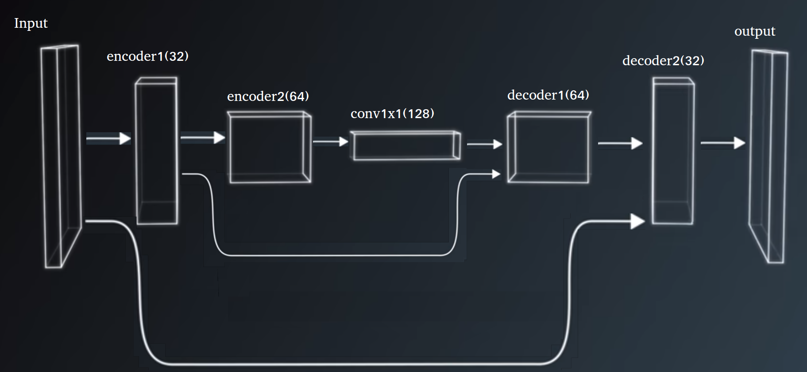
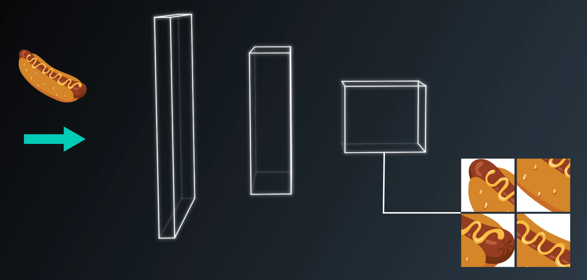
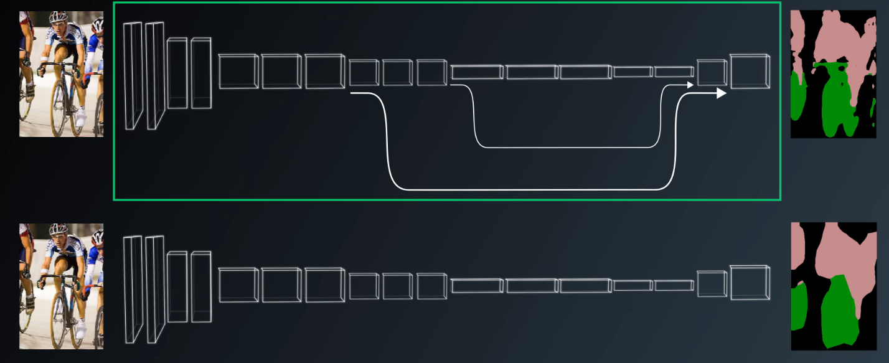
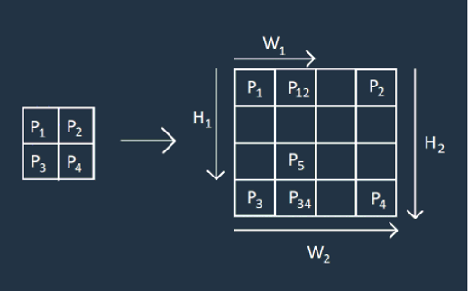
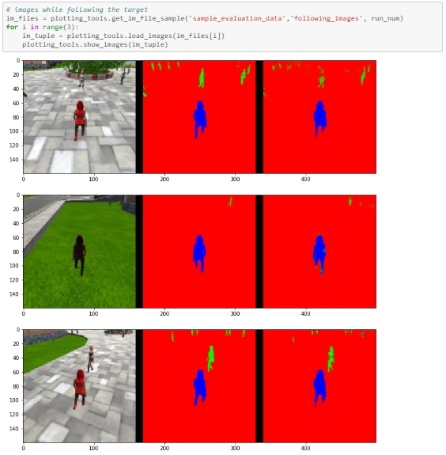
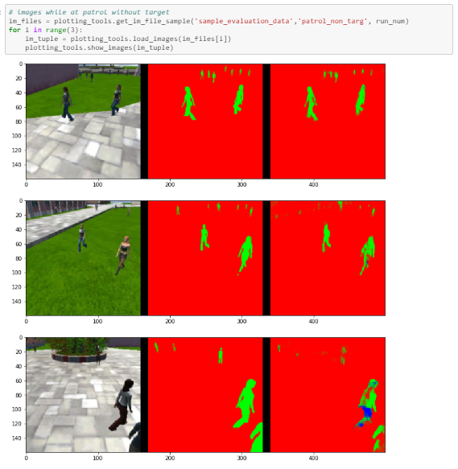
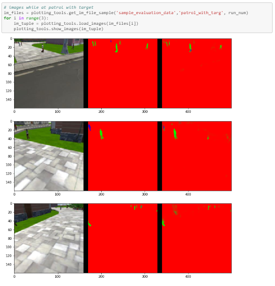

## Project: Follow-me drone

<div align=center>
        
</div>
<br>

I'll start this report with the final grade score:
```
In [63]: # And the final grade score is 
final_score = final_IoU * weight
print(final_score)
```
Result: 0.41784247025954463

## Network Architecture Explained

The network architecture used in this exercise is a Fully Convolutional Network (FCN for short).  A FCN has the ability to detect a target object within a given image.  FCN differs from a Convolutional Neural Network (CNN) in that the latter is mostly used for classifying a given image (as opposed to detecting a target object within an image).  The strength of a FCN is the retention of spatial information surrounding the target object.

A FCN is transformed from a CNN in the following ways:
1.  The fully connected layers of a CNN are replaced with 1x1 Convolutional Layers (in order to keep spatial information)
2.  The “Up Sampling” technique is used to increase an image to a higher resolution
3.  The “Skip Connections” technique is used to retain additional features of an image 

### The benefits of encoding and decoding

A FCN is composed, at a high-level, of 3 parts:
1. Encoding
2. 1x1 convolution
3. Decoding

<div align=center>
        
</div>
<br>

**Encoder** <br>
The purpose of the encoder layers is to simultaneously compress the original images (reducing the resolution) while capturing key features of the images.  These features will provide cues/information for classification. 

From a technical point of view, the encoder block takes in the image data for processing within two functions to produce the output layer: separable_conv2d_batchnorm and separable_conv2d_batchnorm.

## Encoder block

```
def  encoder_blockencoder (input_layer, filters, strides):
    
    # TODO Create a separable convolution layer using the separable_conv2d_batchnorm() function.
    output_layer = separable_conv2d_batchnorm(input_layer, filters, strides)
    
    return output_layer
```
...
```
def separable_conv2d_batchnorm(input_layer, filters, strides=1):
    output_layer = SeparableConv2DKeras(filters=filters,kernel_size=3, strides=strides,
                             padding='same', activation='relu')(input_layer)
    
    output_layer = layers.BatchNormalization()(output_layer) 
    return output_layer
```

**1 by 1 convolution – where/when/how it should be used** <br>
A 1 x 1 convolution layer is used when the spatial information within an image needs to be kept intact.  The 1 x 1 convolution layer will evaluate the compressed image for target object identification.  The target object will have a unique values during this processing.

<div align=center>
        
</div>
<br>

From a technical point of view, the 1x1 convolution is used to reduce the number of depth channels.  It compresses the previous filter dimensions to 1 (dimensionality reduction).  Thus, speeding up the computation process.

**Decoder** <br>
The decoder is simply used to increase an image to its original size.  Because the encoding process has compressed the original image while losing a bit of spatial information, the decoded image will only display general shapes. During the decoding process, in order to “save” additional details from the original image, a technique called “skip connections” is used to maintain additional details of the original image in the output file.  The screenshot below displays the difference between using and not using the “skip connections” technique. 

<div align=center>
        
</div>
<br> 

For this exercise, a billinear upsampling was used to increase the size of the image.  Because the decoder processes the output image from the 1x1 convolution, the image can be increased in size using both axis.

<div align=center>
        
</div>
<br> 

### Decoder block of code

```
def decoder_block(small_ip_layer, large_ip_layer, filters):
    
    # TODO Upsample the small input layer using the bilinear_upsample() function.
    upsample = bilinear_upsample(small_ip_layer)
    
    # TODO Concatenate the upsampled and large input layers using layers.concatenate
    concat_layer = layers.concatenate([upsample, large_ip_layer])

    # TODO Add some number of separable convolution layers
    output_layer = separable_conv2d_batchnorm(concat_layer, filters)
    
    return output_layer
```
...
```
def bilinear_upsample(input_layer):
    output_layer = BilinearUpSampling2D((2,2))(input_layer)
    return output_layer
```
...
```
def separable_conv2d_batchnorm(input_layer, filters, strides=1):
    output_layer = SeparableConv2DKeras(filters=filters,kernel_size=3, strides=strides,
                             padding='same', activation='relu')(input_layer)
    
    output_layer = layers.BatchNormalization()(output_layer) 
    return output_layer
```

### Hyper Parameters Explained
For this project, achieving a final grade score over 0.40 (40%) was made possible with the following Neural Network parameters:
```
learning_rate = 0.0005
batch_size = 64
num_epochs = 50
steps_per_epoch = 72
validation_steps = 50
workers = 2
``` 

### Neural Network parameters - explained:<br>
**1. Learning Rate - The rate at which 'old beliefs' are abandoned for new ones.**<br>
At the start of the project, the learning rate was set to 0.  During my experimentation with the code, I set the learning rate to 0.001.  I eventually reduced the learning rate to 0.0007 and then finally to 0.0005.  This was the last variable changed in order to achieve the final grade score above 0.40.<br>

**2. Batch Size - number of training samples/images that get propagated through the network in a single pass.**<br>
The batch size was also set to 0 at the start of the project.  I set this number to 64.<br>

**3. Number of Epoch - number of times the entire training dataset gets propagated through the network.**<br>
This variable was also set to 0 at the beginning of the project.  I went as I up as 100 for this variable and eventually settled on 50.  I reduced this number to prevent overfitting the data and focused my attention a little more on the learning rate to achieve the final grade score above 0.40.<br>

**4. Steps per Epoch - number of batches of training images that go through the network in 1 epoch.**<br>
This variable was also set to 200.  Similar to the "Number of Epoch" variable, I decided to reduce the number of steps to 72 to prevent overfitting the data and focused my attention a little more on the learning rate to achieve the final grade score above 0.40.<br>

**5. Validation Steps - number of batches of validation images that go through the network in 1 epoch.**<br>
This variable was initially set to 50.  I left this variable intact.<br>

**6. Workers - maximum number of processes to spin up. This can affect your training speed and is dependent on your hardware.**<br>
This variable was initially set to 2.  I left this variable intact as my hardware seemed to run the exercise without any major delays.<br>

## Conclusion

As with any machine learning algorithm, data is key.  To improve the scores and predictability of this exercise, the quality of images for both training and validation sets is key.  Capturing quality images of the Hero and the absence of the Hero will improve the scores of this exercise.  In addition, getting a variation of images that are close-up and far-away would also improve the scores of this exercise.

Some of the visuals below show the innacuracy of the algorithm when attempting to identify the hero target...

<div align=center>
        
</div>
<br> 

<div align=center>
        
</div>
<br> 

<div align=center>
        
</div>
<br> 


I don't believe this model would fair well with other objects such as dogs, cats, cars, etc...  This model is trained on a red person target.  The model would need to be re-trained with many samples of a different object/target to be effective.